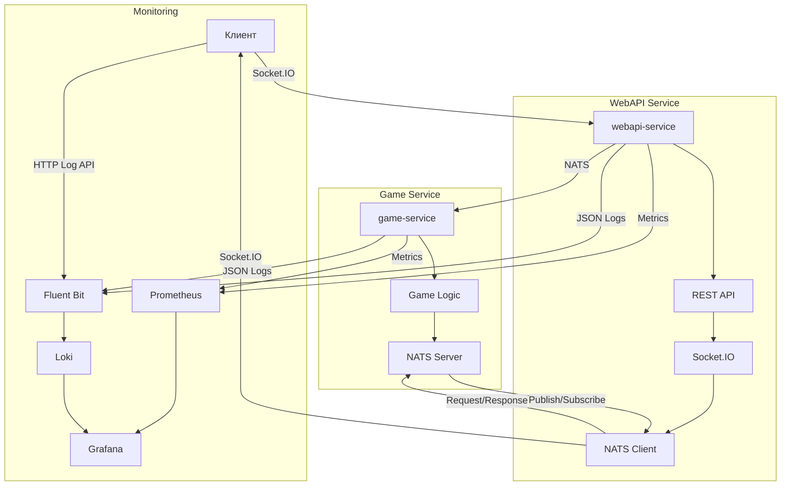

# Bomberman Online

Многопользовательская игра Bomberman, работающая на микросервисной архитектуре.

## Архитектура

Проект разделен на следующие микросервисы:

1. **webapi-service** - REST API и Socket.IO интерфейс для клиентов
2. **game-service** - Игровая логика и механика 
3. **web-frontend** - Клиентский интерфейс на TypeScript

Для коммуникации между сервисами используется NATS.

## Технологии

- **Backend**: Python 3.12, FastAPI, Socket.IO, NATS
- **Frontend**: TypeScript, HTML5 Canvas
- **Database**: PostgreSQL, Redis
- **Infrastructure**: Docker, Docker Compose
- **Monitoring**: Prometheus, Grafana, Loki, Fluent Bit

## Запуск проекта

### С использованием Docker

1. Клонируйте репозиторий:
   ```bash
   git clone https://github.com/your-repo/BombermanOnline.git
   cd BombermanOnline
   ```

2. Создайте файлы .env на основе .env-example:
   ```bash
   cp services/webapi-service/.env-example services/webapi-service/.env
   cp services/game-service/.env-example services/game-service/.env
   ```

3. Запустите сервисы:
   ```bash
   docker-compose up
   ```

4. Игра будет доступна по адресу: http://localhost:3000
5. Мониторинг доступен по следующим адресам:
   - Grafana: http://grafana.localhost (логин/пароль: admin/admin)
   - Prometheus: http://prometheus.localhost
   - Traefik Dashboard: http://traefik.localhost

### Локальная разработка

1. Установите Python 3.12 и Node.js

2. Установите зависимости Python:
   ```bash
   pip install uv
   uv pip install -e .
   ```

3. Установите зависимости Node.js:
   ```bash
   cd frontend
   npm install
   ```

4. Запустите сервисы в отдельных терминалах:
   ```bash
   # WebAPI сервис
   uvicorn services.webapi-service.app.main:app --host 0.0.0.0 --port 5001 --reload
   
   # Game сервис
   uvicorn services.game-service.app.main:app --host 0.0.0.0 --port 5002 --reload
   
   # Frontend
   cd frontend
   npm run dev
   ```

## Управление

- **Движение**: Стрелки или WASD
- **Установка бомбы**: Пробел
- **Перезапуск**: R (когда игра окончена)

## Мультиплеер

Игра поддерживает до 4-х игроков. Для подключения других игроков:
1. Первый игрок создает игру и получает ID игры
2. Другие игроки присоединяются, вводя этот ID

## Мониторинг и логирование

Проект включает следующие компоненты мониторинга:

1. **Prometheus** - сбор и хранение метрик
2. **Grafana** - визуализация метрик и логов
3. **Loki** - агрегация и хранение логов
4. **Fluent Bit** - сбор и пересылка логов
5. **Node Exporter** - сбор метрик хост-системы
6. **cAdvisor** - сбор метрик контейнеров

Все микросервисы настроены на отправку метрик в Prometheus и логов в формате JSON:
- Backend сервисы выводят логи в JSON формате в stdout, который собирается Fluent Bit
- Frontend отправляет логи через HTTP API на эндпоинт /logs, который проксируется на Fluent Bit

## Структура проекта

```
BombermanOnline/
├── services/
│   ├── webapi-service/   # REST API и Socket.IO сервис
│   ├── game-service/     # Игровая логика
│   └── web-frontend/     # Клиентский интерфейс
├── infra/
│   ├── docker-compose.yml    # Конфигурация Docker Compose
│   ├── prometheus/           # Конфигурация Prometheus
│   ├── grafana/              # Конфигурация Grafana
│   ├── loki/                 # Конфигурация Loki
│   ├── fluent-bit/           # Конфигурация Fluent Bit
│   └── traefik/              # Конфигурация Traefik
└── pyproject.toml        # Зависимости Python
```

## Диаграмма архитектуры


