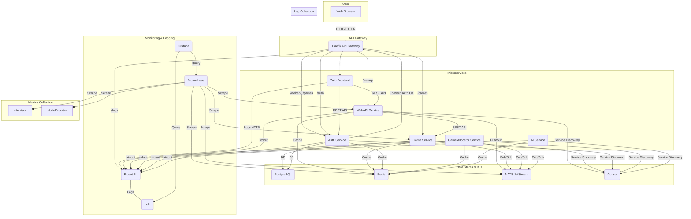

# Bomberman Online
[](README_RU.md)

Multiplayer Bomberman game with an online mode.

## Architecture

The project is built on a microservice architecture. Service interaction is handled via REST APIs and the NATS asynchronous messaging system. Service discovery is implemented using Consul.



## Documentation

Here you will find detailed documentation for the various components of the Bomberman Online project.

### Microservices

*   [AI Service](services/ai-service/README.md)
*   [Auth Service](services/auth-service/README.md)
*   [Game Allocator Service](services/game-allocator-service/README.md)
*   [Game Service](services/game-service/README.md)
*   [Web Frontend](services/web-frontend/README.md)
*   [WebAPI Service](services/webapi-service/README.md)

### Infrastructure

Detailed descriptions of each infrastructure component, its purpose, and configuration.

*   **[Traefik](docs/en/infra/traefik/index.md)** (API Gateway & Routing)
*   **[Prometheus](docs/en/infra/prometheus/index.md)** (Metrics Collection)
*   **[Loki](docs/en/infra/loki/index.md)** (Log Aggregation)
*   **[Fluent Bit](docs/en/infra/fluent-bit/index.md)** (Log Forwarding)
*   **[Grafana](docs/en/infra/grafana/index.md)** (Visualization & Dashboards)
*   **[Consul](docs/en/infra/consul/index.md)** (Service Discovery)
*   **[PostgreSQL](docs/en/infra/postgres/index.md)** (Database)
*   **[Redis](docs/en/infra/redis/index.md)** (Caching)
*   **[NATS](docs/en/infra/nats/index.md)** (Message Bus)
*   **Exporters**
    *   [Node Exporter](docs/en/infra/node-exporter/index.md)
    *   [cAdvisor](docs/en/infra/cadvisor/index.md)
    *   [Redis Exporter](docs/en/infra/redis-exporter/index.md)
    *   [NATS Exporter](docs/en/infra/prometheus-nats-exporter/index.md)
*   **[TensorBoard](docs/en/infra/tensorboard/index.md)** (AI Training Visualization)

## Services

### Web Frontend
A frontend application written in TypeScript using React and Material-UI. It is responsible for the entire user interface, rendering the game board via the Canvas API, and interacting with the backend through a REST API.

### WebAPI Service
The main gateway for client requests. It handles HTTP requests from the `Web Frontend`, manages WebSocket connections for gameplay, and communicates with other services to execute business logic (creating games, retrieving information, etc.).

### Game Service
The heart of the game logic. It manages the state of active game sessions: processing player actions, calculating physics, and applying game rules. It communicates with other services via NATS and REST, and saves game results to PostgreSQL.

### Auth Service
Responsible for everything related to users: registration, authentication, JWT token and role management. It provides a `Forward Auth` mechanism for Traefik to protect other services.

### Game Allocator Service
A dispatcher service responsible for efficiently distributing game sessions across available `Game Service` instances. It monitors the current load and finds the most suitable server for a new game, ensuring scalability and fault tolerance.

### AI Service
Manages the behavior of AI units (bots) in the game. The service subscribes to game state events from NATS, makes decisions based on trained models, and sends control commands for the AI back to the `Game Service` via NATS.

## Project Startup

### Requirements

-   Docker and Docker Compose

### Startup

```bash
# Clone the repository
git clone https://github.com/yourusername/BombermanOnline.git
cd BombermanOnline

# Start all services
docker-compose -f docker-compose.yml -f infra/docker-compose.yml up -d --build
```

### Accessing Services

After startup, services are available at the following addresses:

-   **Game & Frontend**: `http://localhost`
-   **Traefik Dashboard**: `http://traefik.localhost` (or `http://localhost:8080`)
-   **Grafana**: `http://grafana.localhost` (admin/admin)
-   **Prometheus**: `http://prometheus.localhost`
-   **Consul UI**: `http://localhost:8500`
-   **TensorBoard**: `http://localhost:6006`

## Technologies

### Frontend
- **Framework**: React 18 with TypeScript
- **UI Components**: Material-UI
- **Routing**: React Router
- **State Management & Forms**: Formik & Yup
- **API Communication**: Axios (for REST), Socket.IO Client (for WebSockets)
- **Rendering**: Canvas API for the game board

### Backend
- **Framework**: FastAPI (with Uvicorn)
- **Database**: PostgreSQL (with SQLAlchemy and Alembic)
- **In-Memory Cache**: Redis
- **Messaging**: NATS (for asynchronous communication)
- **Service Discovery**: Consul
- **Real-time Communication**: WebSockets (via `python-socketio`)
- **Authentication**: JWT with `python-jose` and `passlib`
- **AI & Machine Learning**:
  - **Training**: Stable Baselines3
  - **Environment**: Gymnasium
  - **Visualization**: TensorBoard

### DevOps
- Docker + Docker Compose
- Traefik (API Gateway)
- Prometheus + Grafana (Monitoring)
- Loki + Fluent Bit (Logging)

## License
