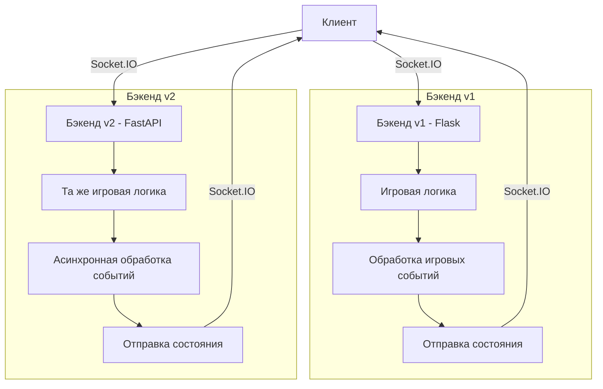

# Bomberman Online

Многопользовательская игра Bomberman с серверной логикой на Python и отрисовкой на Canvas/TypeScript.

## Архитектура

- **Бэкенд v1 (Python/Flask/SocketIO)**: Обрабатывает всю игровую логику, физику, коллизии
- **Бэкенд v2 (Python/FastAPI/SocketIO)**: Новая версия, реализующая ту же функциональность на FastAPI
- **Фронтенд (TypeScript/Canvas)**: Отрисовка игры и обработка пользовательского ввода

## Технический стек

### Бэкенд v1 (Flask):
- Python 3.12
- Flask
- Flask-SocketIO
- Eventlet

### Бэкенд v2 (FastAPI):
- Python 3.12
- FastAPI
- Socket.IO (python-socketio)
- Uvicorn

### Фронтенд:
- TypeScript
- HTML5 Canvas
- Socket.IO Client

## Запуск

### С использованием Docker

Самый простой способ запустить игру:

```bash
docker-compose up
```

После запуска:
- Бэкенд v1 (Flask) будет доступен на http://localhost:5000
- Бэкенд v2 (FastAPI) будет доступен на http://localhost:5001
- Фронтенд будет доступен на http://localhost:3000

### Ручной запуск

#### Установка зависимостей
```bash
# Установка uv если его нет
pip install uv

# Установка зависимостей проекта
uv pip install -e .
```

#### Запуск бэкенда v1 (Flask)
```bash
cd server
python app.py
```

#### Запуск бэкенда v2 (FastAPI)
```bash
cd server2
uvicorn main:app --host 0.0.0.0 --port 5001 --reload
```

#### Запуск фронтенда
```bash
npm install
npm start
```

## Управление

- **Движение**: Стрелки или WASD
- **Установка бомбы**: Пробел
- **Перезапуск**: R (когда игра окончена)

## Мультиплеер

Игра поддерживает до 4-х игроков. Для подключения других игроков:
1. Первый игрок создает игру и получает ID игры
2. Другие игроки присоединяются, вводя этот ID

## Различия между версиями бэкенда

Основные различия между версиями бэкенда:

1. **API и маршрутизация**:
   - В1 (Flask): Использует Flask и Flask-SocketIO
   - В2 (FastAPI): Использует FastAPI и более современный асинхронный подход с python-socketio

2. **Производительность**:
   - FastAPI-версия использует асинхронный код, что может обеспечить лучшую масштабируемость при большом количестве одновременных соединений

3. **Документация API**:
   - FastAPI имеет встроенную автоматическую документацию (Swagger)

Игровая логика идентична в обеих версиях, что позволяет использовать один и тот же фронтенд для подключения к любой из версий сервера.

## Диаграмма архитектуры


