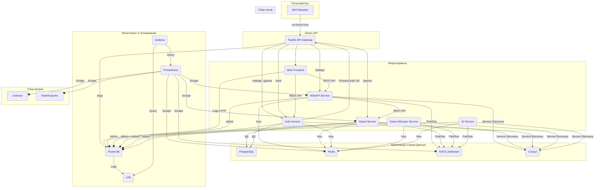

# Bomberman Online
[](README.md)

Многопользовательская игра Bomberman с онлайн-режимом.

## Архитектура

Проект построен на микросервисной архитектуре. Взаимодействие между сервисами осуществляется через REST API и асинхронную систему обмена сообщениями NATS. Обнаружение сервисов реализовано через Consul.



## Документация

Здесь вы найдете подробную документацию по различным компонентам проекта Bomberman Online.

### Микросервисы

*   [AI Service](services/ai-service/README_RU.md)
*   [Auth Service](services/auth-service/README_RU.md)
*   [Game Allocator Service](services/game-allocator-service/README_RU.md)
*   [Game Service](services/game-service/README_RU.md)
*   [Web Frontend](services/web-frontend/README_RU.md)
*   [WebAPI Service](services/webapi-service/README_RU.md)

### Инфраструктура

Детальное описание каждого инфраструктурного компонента, его назначения и конфигурации.

*   **[Traefik](docs/ru/infra/traefik/index.md)** (API Gateway и маршрутизация)
*   **[Prometheus](docs/ru/infra/prometheus/index.md)** (Сбор метрик)
*   **[Loki](docs/ru/infra/loki/index.md)** (Агрегация логов)
*   **[Fluent Bit](docs/ru/infra/fluent-bit/index.md)** (Пересылка логов)
*   **[Grafana](docs/ru/infra/grafana/index.md)** (Визуализация и дашборды)
*   **[Consul](docs/ru/infra/consul/index.md)** (Обнаружение сервисов)
*   **[PostgreSQL](docs/ru/infra/postgres/index.md)** (База данных)
*   **[Redis](docs/ru/infra/redis/index.md)** (Кэширование)
*   **[NATS](docs/ru/infra/nats/index.md)** (Шина сообщений)
*   **Экспортеры метрик**
    *   [Node Exporter](docs/ru/infra/node-exporter/index.md)
    *   [cAdvisor](docs/ru/infra/cadvisor/index.md)
    *   [Redis Exporter](docs/ru/infra/redis-exporter/index.md)
    *   [NATS Exporter](docs/ru/infra/prometheus-nats-exporter/index.md)
*   **[TensorBoard](docs/ru/infra/tensorboard/index.md)** (Визуализация обучения AI)

## Сервисы

### Web Frontend
Frontend приложение, написанное на TypeScript с использованием React и Material-UI. Отвечает за весь пользовательский интерфейс, отрисовку игрового поля через Canvas API и взаимодействие с бэкендом по REST API.

### WebAPI Service
Основной шлюз для клиентских запросов. Обрабатывает HTTP-запросы от `Web Frontend`, управляет WebSocket-соединениями для игры, взаимодействует с другими сервисами для выполнения бизнес-логики (создание игр, получение информации и т.д.).

### Game Service
Сердце игровой логики. Управляет состоянием активных игровых сессий: обрабатывает действия игроков, рассчитывает физику, применяет правила игры. Общается с другими сервисами через NATS и REST, сохраняет результаты игр в PostgreSQL.

### Auth Service
Отвечает за все, что связано с пользователями: регистрация, аутентификация, управление JWT-токенами и ролями. Предоставляет механизм `Forward Auth` для Traefik, защищая другие сервисы.

### Game Allocator Service
Сервис-распределитель, отвечающий за эффективное распределение игровых сессий по доступным экземплярам `Game Service`. Он отслеживает текущую нагрузку и находит наиболее подходящий сервер для новой игры, обеспечивая масштабируемость и отказоустойчивость.

### AI Service
Управляет поведением AI-юнитов (ботов) в игре. Сервис подписывается на события игрового состояния из NATS, принимает решения на основе обученных моделей и отправляет команды управления для AI обратно в `Game Service` через NATS.

## Запуск проекта

### Требования

-   Docker и Docker Compose

### Запуск

```bash
# Клонирование репозитория
git clone https://github.com/yourusername/BombermanOnline.git
cd BombermanOnline

# Запуск всех сервисов
docker-compose -f docker-compose.yml -f infra/docker-compose.yml up -d --build
```

### Доступ к сервисам

После запуска сервисы доступны по следующим адресам:

-   **Игра и Frontend**: `http://localhost`
-   **Traefik Dashboard**: `http://traefik.localhost` (или `http://localhost:8080`)
-   **Grafana**: `http://grafana.localhost` (admin/admin)
-   **Prometheus**: `http://prometheus.localhost`
-   **Consul UI**: `http://localhost:8500`
-   **TensorBoard**: `http://localhost:6006`

## Технологии

### Frontend
- **Фреймворк**: React 18 с TypeScript
- **UI-компоненты**: Material-UI
- **Маршрутизация**: React Router
- **Управление состоянием и формы**: Formik и Yup
- **Взаимодействие с API**: Axios (для REST), Socket.IO Client (для WebSocket)
- **Отрисовка**: Canvas API для игрового поля

### Backend
- **Фреймворк**: FastAPI (с Uvicorn)
- **База данных**: PostgreSQL (с SQLAlchemy и Alembic)
- **Кэш в памяти**: Redis
- **Обмен сообщениями**: NATS (для асинхронной коммуникации)
- **Обнаружение сервисов**: Consul
- **Обмен данными в реальном времени**: WebSockets (через `python-socketio`)
- **Аутентификация**: JWT с `python-jose` и `passlib`
- **AI и машинное обучение**:
  - **Обучение**: Stable Baselines3
  - **Среда**: Gymnasium
  - **Визуализация**: TensorBoard

### DevOps
- Docker + Docker Compose
- Traefik (API Gateway)
- Prometheus + Grafana (Мониторинг)
- Loki + Fluent Bit (Логирование)

## Лицензия

