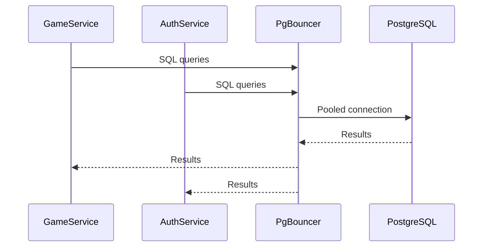

# PostgreSQL Connection Flow with PgBouncer

This diagram shows how PgBouncer sits between application services and PostgreSQL.

```mermaid
sequenceDiagram
    participant GameService
    participant AuthService
    participant PgBouncer
    participant PostgreSQL
    GameService->>PgBouncer: SQL queries
    AuthService->>PgBouncer: SQL queries
    PgBouncer->>PostgreSQL: Pooled connection
    PostgreSQL-->>PgBouncer: Results
    PgBouncer-->>GameService: Results
    PgBouncer-->>AuthService: Results
```

