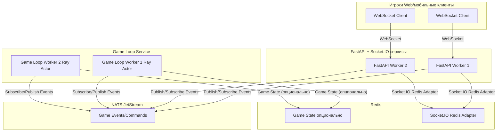

```mermaid
flowchart TD
    subgraph Clients[Игроки Web/мобильные клиенты]
        direction TB
        WSClient1[WebSocket Client]
        WSClient2[WebSocket Client]
    end

    subgraph API[FastAPI + Socket.IO сервисы]
        direction TB
        FastAPIApp1[FastAPI Worker 1]
        FastAPIApp2[FastAPI Worker 2]
    end

    subgraph Redis[Redis]
        RedisState[Game State опционально]
        RedisPubSub[Socket.IO Redis Adapter]
    end

    subgraph NATS[NATS JetStream]
        NATSBus[Game Events/Commands]
    end

    subgraph GameLoop[Game Loop Service]
        GameLoopProc1[Game Loop Worker 1 Ray Actor]
        GameLoopProc2[Game Loop Worker 2 Ray Actor]
    end

    WSClient1 -- WebSocket --> FastAPIApp1
    WSClient2 -- WebSocket --> FastAPIApp2

    FastAPIApp1 -- "Socket.IO Redis Adapter" --> RedisPubSub
    FastAPIApp2 -- "Socket.IO Redis Adapter" --> RedisPubSub

    FastAPIApp1 -- "Publish/Subscribe Events" --> NATSBus
    FastAPIApp2 -- "Publish/Subscribe Events" --> NATSBus

    GameLoopProc1 -- "Subscribe/Publish Events" --> NATSBus
    GameLoopProc2 -- "Subscribe/Publish Events" --> NATSBus

    GameLoopProc1 -- "Game State (опционально)" --> RedisState
    GameLoopProc2 -- "Game State (опционально)" --> RedisState
```