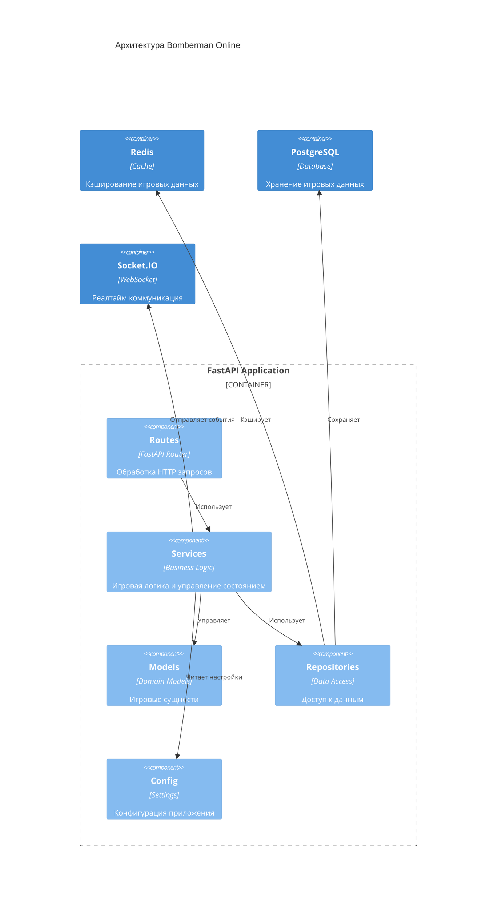

# Архитектура проекта Bomberman Online

## Диаграмма компонентов



## Структура проекта

```
server2/
├── app/
│   ├── __init__.py
│   ├── main.py           # Основной файл приложения
│   ├── config.py         # Конфигурация приложения
│   ├── routes/           # Маршруты API
│   │   ├── __init__.py
│   │   └── game_routes.py
│   ├── services/         # Бизнес-логика
│   │   ├── __init__.py
│   │   └── game_service.py
│   ├── models/          # Модели данных
│   │   └── __init__.py
│   └── repositories/    # Репозитории для работы с данными
│       ├── __init__.py
│       ├── redis_repository.py
│       └── postgres_repository.py
├── game/               # Игровая логика
│   ├── __init__.py
│   ├── game.py
│   ├── player.py
│   ├── enemy.py
│   ├── bomb.py
│   ├── map.py
│   └── power_up.py
├── .env-example        # Пример файла с переменными окружения
└── README.md          # Документация проекта
```