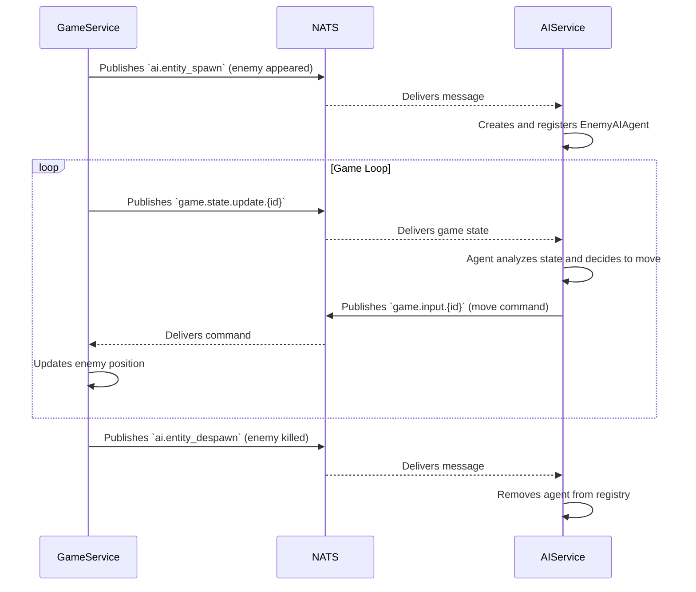

# Interaction and Use Cases

## Core Principle

The AI-Service acts as an "external brain" for AI-controlled units in the game. It does not change the game state directly but only reacts to it and sends control commands, just as a human player would.

## Interaction via NATS

The service actively uses NATS for asynchronous data exchange with `game-service`.

### Subscriptions (Incoming Messages)

The service listens to the following topics:

*   `ai.entity_spawn`:
    *   **Source**: `game-service`
    *   **Description**: A message about the appearance of a new unit in the game that should be controlled by AI (an enemy or a bot player).
    *   **Action**: The AI-Service creates an instance of the corresponding agent (`EnemyAIAgent` or `BombermanAIAgent`) and saves it in the `AIAgentRegistry`.

*   `ai.entity_despawn`:
    *   **Source**: `game-service`
    *   **Description**: A message about the disappearance (death) of an AI-controlled unit.
    *   **Action**: The AI-Service removes the corresponding agent from the registry.

*   `game.state.update.{game_id}`:
    *   **Source**: `game-service`
    *   **Description**: An incremental update of the game session state. It arrives regularly (several times a second).
    *   **Action**: For each active agent in the given game, the service passes the new state to it. The agent makes a decision based on this state and, if necessary, generates a command.

### Publications (Outgoing Messages)

Agents within the service can send commands to `game-service`:

*   `game.input.{game_id}`:
    *   **Recipient**: `game-service`
    *   **Description**: A command to move a unit.
    *   **Example Data**: `{ "entity_id": "player-123", "direction": "up", "is_moving": true }`

*   `game.place_weapon.{game_id}`:
    *   **Recipient**: `game-service`
    *   **Description**: A command to place a bomb.
    *   **Example Data**: `{ "entity_id": "player-123" }`

## Interaction Diagram

## Use Cases

1.  **Enemy Control**: The basic scenario where the service takes control of all enemies on the map, making them patrol, chase players, and place bombs.
2.  **Bot Players**: AI-controlled players can be added to the lobby to fill empty slots. The service will control them just like enemies, but with potentially more complex logic.
3.  **Model Training**: In a special mode, the service runs a simulation in the `BombermanEnv` environment and uses `Stable-Baselines3` to train a new behavior model (e.g., to teach an agent to efficiently collect bonuses).
