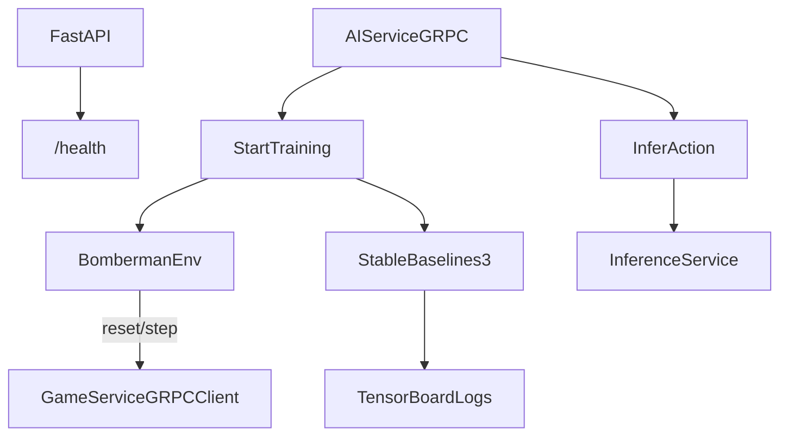

```mermaid
flowchart TD
    FastAPI["FastAPI"] --> Health["/health"]
    AIServiceGRPC["AIServiceGRPC"] --> TrainFlow["StartTraining"]
    AIServiceGRPC --> InferFlow["InferAction"]
    TrainFlow --> GymEnv["BombermanEnv"]
    GymEnv -->|"reset/step"| GameServiceGRPCClient["GameServiceGRPCClient"]
    TrainFlow --> SB3["StableBaselines3"]
    SB3 --> TB["TensorBoardLogs"]
    InferFlow --> InferenceService["InferenceService"]
```

