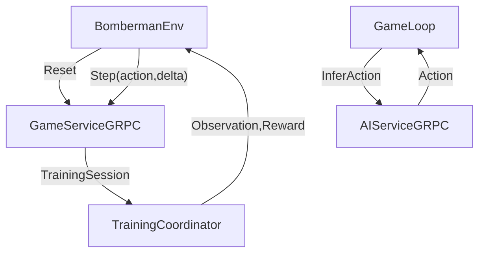

```mermaid
flowchart TD
    aiEnv[BombermanEnv] -->|"Reset"| gameGrpc[GameServiceGRPC]
    aiEnv -->|"Step(action,delta)"| gameGrpc
    gameGrpc -->|"TrainingSession"| gameTrain[TrainingCoordinator]
    gameTrain -->|"Observation,Reward"| aiEnv
    classicLoop[GameLoop] -->|"InferAction"| aiGrpc[AIServiceGRPC]
    aiGrpc -->|"Action"| classicLoop
```

