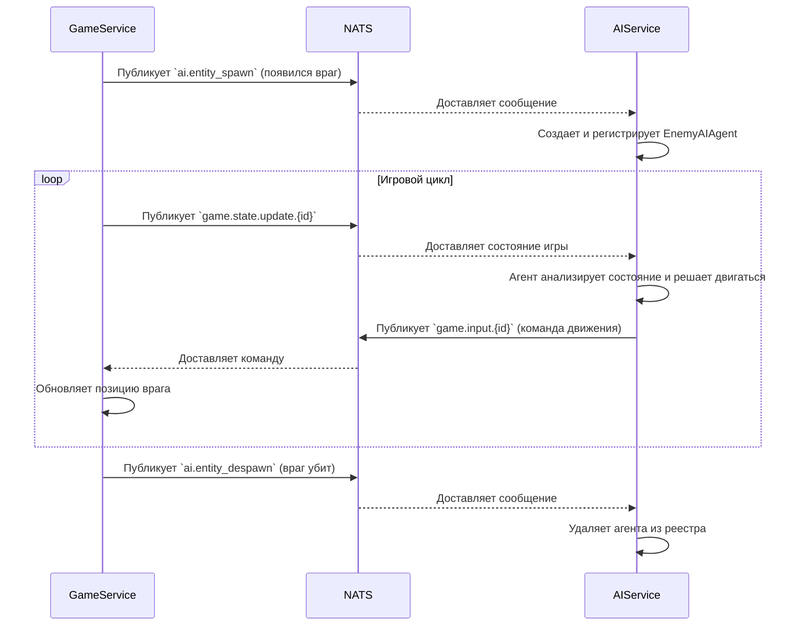

# Взаимодействие и Use Cases

## Основной принцип

AI-Service работает как "внешний мозг" для AI-управляемых юнитов в игре. Он не меняет состояние игры напрямую, а лишь реагирует на него и отправляет команды управления, как если бы это делал живой игрок.

## Взаимодействие через NATS

Сервис активно использует NATS для асинхронного обмена данными с `game-service`.

### Подписки (входящие сообщения)

Сервис слушает следующие темы:

*   `ai.entity_spawn`:
    *   **Источник**: `game-service`
    *   **Описание**: Сообщение о появлении в игре нового юнита, которым должен управлять AI (враг или игрок-бот).
    *   **Действие**: AI-Service создает инстанс соответствующего агента (`EnemyAIAgent` или `BombermanAIAgent`) и сохраняет его в реестре `AIAgentRegistry`.

*   `ai.entity_despawn`:
    *   **Источник**: `game-service`
    *   **Описание**: Сообщение об исчезновении (смерти) AI-управляемого юнита.
    *   **Действие**: AI-Service удаляет соответствующего агента из реестра.

*   `game.state.update.{game_id}`:
    *   **Источник**: `game-service`
    *   **Описание**: Инкрементальное обновление состояния игровой сессии. Приходит регулярно (несколько раз в секунду).
    *   **Действие**: Для каждого активного агента в данной игре, сервис передает ему новое состояние. Агент на основе этого состояния принимает решение и, если необходимо, генерирует команду.

### Публикации (исходящие сообщения)

Агенты внутри сервиса могут отправлять команды в `game-service`:

*   `game.input.{game_id}`:
    *   **Получатель**: `game-service`
    *   **Описание**: Команда на перемещение юнита.
    *   **Пример данных**: `{ "entity_id": "player-123", "direction": "up", "is_moving": true }`

*   `game.place_weapon.{game_id}`:
    *   **Получатель**: `game-service`
    *   **Описание**: Команда на установку бомбы.
    *   **Пример данных**: `{ "entity_id": "player-123" }`

## Диаграмма взаимодействия

## Use Cases

1.  **Управление врагами**: Базовый сценарий, где сервис получает управление всеми врагами на карте, заставляя их патрулировать, преследовать игроков и ставить бомбы.
2.  **Игроки-боты**: В лобби можно добавить игроков, управляемых AI, чтобы заполнить пустые слоты. Сервис будет управлять ими так же, как и врагами, но с потенциально более сложной логикой.
3.  **Обучение моделей**: В специальном режиме сервис запускает симуляцию в среде `BombermanEnv` и использует `Stable-Baselines3` для обучения новой модели поведения (например, научить агента эффективно собирать бонусы).
