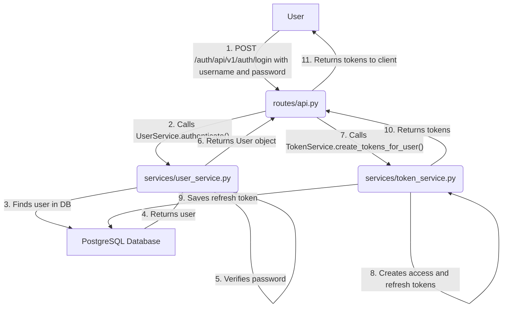

# 8. Architecture and Logic

[](../ru/08_architecture.md)

The service is built using a multi-layered architecture for a clear separation of responsibilities between components.

## Project Structure

```
app/
├── alembic/          # Database migrations (Alembic)
├── models/           # Data models (SQLAlchemy and Pydantic)
├── routes/           # API and web interface routes
├── services/         # Business logic
├── static/           # Static files (CSS, JS)
├── templates/        # HTML templates
├── config.py         # Configuration
├── database.py       # DB connection setup
├── dependencies.py   # FastAPI dependencies (e.g., get_current_user)
├── logging_config.py # Logging setup
├── main.py           # FastAPI application entry point
└── redis_client.py   # Client for working with Redis
```

- **`main.py`**: Initializes the FastAPI application, connects middleware (CORS, Prometheus), routers, and `startup`/`shutdown` event handlers.
- **`routes/`**: Define the endpoints. They are responsible for receiving HTTP requests, validating data (using Pydantic models), and calling the corresponding business logic from the services.
- **`services/`**: Contain the core business logic. For example, `UserService` manages user creation and authentication, while `TokenService` handles JWT generation and verification.
- **`models/`**: Define the data structure. SQLAlchemy models describe the database tables, and Pydantic models are used for validating incoming/outgoing API data.
- **`dependencies.py`**: Contains FastAPI dependency functions that are used to get the current user, check access rights, and provide a DB session.
- **`config.py`**: Loads and provides access to all configuration parameters through the `settings` object.

## Sequence Diagram: User Login

Below is a simplified diagram showing the user login process.


