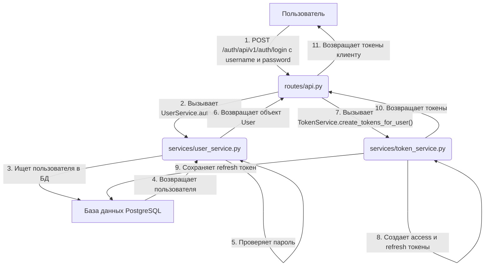

# 8. Архитектура и логика работы

Сервис построен с использованием многоуровневой архитектуры для четкого разделения ответственности между компонентами.

## Структура проекта

```
app/
├── alembic/          # Миграции базы данных (Alembic)
├── models/           # Модели данных (SQLAlchemy и Pydantic)
├── routes/           # Маршруты API и веб-интерфейса
├── services/         # Бизнес-логика
├── static/           # Статические файлы (CSS, JS)
├── templates/        # HTML шаблоны
├── config.py         # Конфигурация
├── database.py       # Настройка подключения к БД
├── dependencies.py   # Зависимости FastAPI (например, get_current_user)
├── logging_config.py # Настройка логирования
├── main.py           # Точка входа приложения FastAPI
└── redis_client.py   # Клиент для работы с Redis
```

- **`main.py`**: Инициализирует приложение FastAPI, подключает middleware (CORS, Prometheus), роутеры и обработчики событий `startup`/`shutdown`.
- **`routes/`**: Определяют эндпоинты. Они отвечают за прием HTTP-запросов, валидацию данных (с помощью Pydantic моделей) и вызов соответствующей бизнес-логики из сервисов.
- **`services/`**: Содержат основную бизнес-логику. Например, `UserService` управляет созданием и аутентификацией пользователей, а `TokenService` - генерацией и проверкой JWT.
- **`models/`**: Определяют структуру данных. Модели SQLAlchemy описывают таблицы в базе данных, а модели Pydantic используются для валидации входящих/исходящих данных в API.
- **`dependencies.py`**: Содержит функции-зависимости FastAPI, которые используются для получения текущего пользователя, проверки прав доступа и предоставления сессии БД.
- **`config.py`**: Загружает и предоставляет доступ ко всем конфигурационным параметрам через объект `settings`.

## Диаграмма последовательности: Вход пользователя

Ниже представлена упрощенная диаграмма, показывающая процесс входа пользователя в систему.


