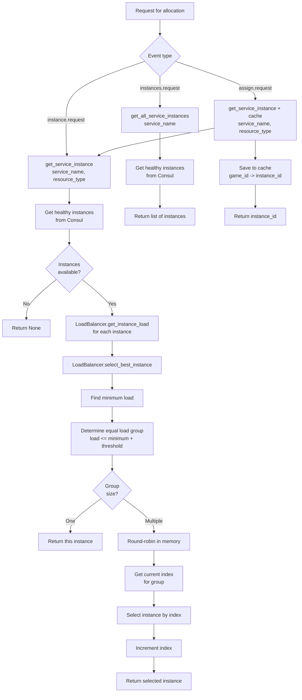

# Game Allocator Service
[](README_RU.md)

The Game Allocator Service is responsible for efficiently distributing game sessions among available game server instances. It uses game server load metrics (CPU and RAM) obtained from Prometheus and consults Consul for healthy instance discovery. The service interacts via NATS to receive game allocation requests and to publish results.

## Service Purpose

The main task of the `game-allocator-service` is to ensure load balancing and optimal utilization of game server resources by intelligently selecting the least loaded instance for a new game session. The service supports a universal load distribution system for any services (game-service, ai-service, and future ones), using load metrics from Prometheus and round-robin rotation between equally loaded instances. This is critically important for maintaining stable performance and minimizing latency in multiplayer games.

## Technologies Used

*   **Python 3.12**: Programming language.
*   **`asyncio`**: Asynchronous I/O for high-performance network operations.
*   **aiohttp**: Asynchronous HTTP framework for implementing healthcheck endpoint.
*   **NATS**: Lightweight, high-performance messaging system used for asynchronous communication between microservices.
*   **Prometheus API Client (`prometheus-api-client`)**: For programmatically querying load metrics from Prometheus.
*   **Consul (`py-consul`)**: For service discovery and obtaining a list of healthy game server instances.
*   **Redis (`redis`)**: Used as a cache to store information about allocated game instances (GameInstanceCache).
*   **Pydantic (`pydantic`, `pydantic-settings`)**: For data validation and configuration management.
*   **Python JSON Logger (`python-json-logger`)**: For structured logging.
*   **UV**: Python package manager used for dependency installation.

## Project Structure

```
services/game-allocator-service/
├── app/
│   ├── __init__.py
│   ├── config.py             # Service configuration settings
│   ├── game_cache.py         # Game instance caching logic in Redis
│   ├── load_balancer.py      # Universal load balancer with round-robin rotation
│   ├── logging_config.py     # Logging configuration
│   ├── main.py               # Main service logic and entry point
│   ├── nats_repository.py    # NATS interaction
│   └── redis_repository.py   # Redis interaction
├── tests/                    # Test suite
│   ├── README.md             # Tests documentation (English)
│   ├── README_RU.md          # Tests documentation (Russian)
│   ├── conftest.py           # Common fixtures and mocks
│   └── test_*.py             # Test files
├── Dockerfile                # Docker image definition for the service
├── pyproject.toml            # Project dependency management (via Poetry/uv)
├── README.md                 # General service information
├── README_RU.md              # General service information (Russian)
└── uv.lock                   # uv dependency lock file
```

## Load Balancing Architecture

The service uses a universal load distribution system that works for all services (game-service, ai-service, and future ones). The system automatically identifies equally loaded instances (within ±LOAD_THRESHOLD threshold) and uses round-robin rotation for even distribution of requests among them.



## NATS Events and API Endpoints

The `game-allocator-service` primarily interacts via NATS events. It subscribes to requests and publishes responses. The service also provides an HTTP endpoint for health checks. Event handlers are automatically registered based on `SERVICE_CONFIGS` configuration.

### HTTP Endpoints

*   **`GET /health`**:
    *   **Description**: Endpoint for service health check. Used by Consul for healthcheck.
    *   **Response (JSON)**:
        ```json
        {
            "status": "healthy",
            "service": "game-allocator-service"
        }
        ```

### Requests

#### Game Allocation

*   **`game.assign.request`**:
    *   **Description**: Request to allocate a new game session to a game server. Uses LoadBalancer to select the best instance considering load and round-robin rotation.
    *   **Sender**: Typically `webapi-service` or another service initiating a new game.
    *   **Payload (JSON)**:

        ```json
        {
            "game_id": "<Game ID>",
            "settings": {
                "resource_level": "low" | "high" // Determines whether to consider CPU (low) or RAM (high) when selecting a server
            }
        }
        ```

#### Get Single Instance (with Load Balancing)

*   **`game.instance.request`**:
    *   **Description**: Request to get one best `Game Service` instance considering load and round-robin rotation.
    *   **Sender**: Typically `ai-service` or other services that need one instance for connection.
    *   **Payload (JSON)**:

        ```json
        {
            "resource_type": "cpu" | "ram" // Resource type to optimize for (default "cpu")
        }
        ```

*   **`ai.instance.request`**:
    *   **Description**: Request to get one best `AI Service` instance considering load and round-robin rotation.
    *   **Sender**: Typically `game-service` for connecting to AI service.
    *   **Payload (JSON)**:

        ```json
        {
            "resource_type": "cpu" | "ram" // Resource type to optimize for (default "cpu")
        }
        ```

#### Get All Instances

*   **`game.instances.request`**:
    *   **Description**: Request to get a list of all healthy `Game Service` instances.
    *   **Sender**: Typically `webapi-service` when it needs to aggregate data from all game service instances (e.g., when getting a list of all games).
    *   **Payload (JSON)**: Empty object `{}`

*   **`ai.instances.request`**:
    *   **Description**: Request to get a list of all healthy `AI Service` instances.
    *   **Sender**: Typically other services that need a full list of instances.
    *   **Payload (JSON)**: Empty object `{}`

### Responses

#### Response to `game.assign.request`

After processing the `game.assign.request`, the service publishes a response to the topic specified in the `msg.reply` of the NATS message.

*   **Payload (JSON)**:

    ```json
    {
        "success": true | false,
        "instance_id": "<IP address or ID of the game server instance>" // Upon successful allocation
    }
    ```

#### Response to `*.instance.request`

After processing the `game.instance.request` or `ai.instance.request`, the service publishes a response to the topic specified in the `msg.reply` of the NATS message.

*   **Payload (JSON)**:

    ```json
    {
        "success": true | false,
        "instance": {
            "address": "<IP address or hostname>",
            "rest_port": 5002,
            "grpc_port": 50051
        } // One best service instance considering load
    }
    ```

#### Response to `*.instances.request`

After processing the `game.instances.request` or `ai.instances.request`, the service publishes a response to the topic specified in the `msg.reply` of the NATS message.

*   **Payload (JSON)**:

    ```json
    {
        "success": true | false,
        "instances": [
            {
                "address": "<IP address or hostname>",
                "rest_port": 5002,
                "grpc_port": 50051
            }
        ] // List of all healthy service instances
    }
    ```

## Interaction with Other Services

*   **Consul**: Used to discover all registered service instances (game-service, ai-service, and others) and check their health. The service also registers itself in Consul with an HTTP healthcheck on the `/health` endpoint, allowing Consul to automatically check instance health and exclude non-working instances from available ones.
*   **Prometheus**: Queries load metrics (CPU, RAM) for each service instance to make allocation decisions. Uses universal PromQL queries with service name.
*   **Redis**: Used as a cache to temporarily store the relationship between `game_id` and `instance_id` (game server IP address).
*   **NATS**: The primary communication channel for receiving game allocation requests and sending responses.
*   **Game Service and AI Service**: Target services for which `game-allocator-service` distributes load. Interaction is indirect, through Consul and Prometheus for monitoring, and through NATS for requests.

## Load Balancing Mechanism

The service uses a universal `LoadBalancer` class for load distribution:

1. **Load Metrics Retrieval**: For each instance, CPU and RAM metrics are queried from Prometheus
2. **Equal Load Instance Detection**: Instances are considered equally loaded if their load difference does not exceed `LOAD_THRESHOLD` (default 2.0%)
3. **Instance Selection**:
   - If only one instance → use it
   - If multiple equally loaded → use round-robin rotation for even distribution
   - If load difference is large → select the least loaded instance
4. **Round-robin Rotation**: Rotation state is stored in service memory. On each request, the next instance from the equally loaded group is selected in round-robin fashion.

## Service Configuration

Services are configured via `SERVICE_CONFIGS` in `config.py`. This allows automatic handler registration for new services without code changes:

```python
SERVICE_CONFIGS = [
    {
        "service_name": "game-service",
        "instance_request_event": "game.instance.request",  # Request for one instance
        "instances_request_event": "game.instances.request",  # Request for all instances
        "assign_event": "game.assign.request",  # Game allocation
    },
    {
        "service_name": "ai-service",
        "instance_request_event": "ai.instance.request",  # Request for one instance
        "instances_request_event": "ai.instances.request",  # Request for all instances
    },
]
```

To add a new service, simply add an entry to `SERVICE_CONFIGS`.

## Environment Variables

Service configuration is managed via environment variables defined in `app/config.py`.

*   `SERVICE_NAME`: Service name, default `game-allocator-service`.
*   `APP_TITLE`: Application title, default `Bomberman Game Allocator Service`.
*   `PORT`: Port for HTTP healthcheck endpoint, default `5005`.
*   `GAME_CACHE_TTL`: Game instance cache time-to-live in seconds, default `60`.
*   `LOAD_THRESHOLD`: Threshold for detecting equally loaded instances (absolute percentage difference), default `2.0`. Instances are considered equally loaded if their load difference does not exceed this value.
*   `SERVICE_CONFIGS`: Service configuration for automatic handler registration (see "Service Configuration" section).
*   `REDIS_HOST`: Redis host, default `localhost`.
*   `REDIS_PORT`: Redis port, default `6379`.
*   `REDIS_DB`: Redis database, default `0`.
*   `REDIS_PASSWORD`: Redis password (optional).
*   `NATS_URL`: NATS server URL, default `nats://localhost:4222`.
*   `PROMETHEUS_URL`: Prometheus server URL, default `http://prometheus:9090`.
*   `CONSUL_HOST`: Consul host, default `consul`.
*   `LOG_LEVEL`: Logging level (DEBUG, INFO, WARNING, ERROR, CRITICAL), default `DEBUG`.
*   `LOG_FORMAT`: Logging format (`text` or `json`), default `text`.
*   `TRACE_CALLER`: Whether to include caller information in logs, default `True`.

## Secrets Management

Secrets are managed in Infisical. The `.env-example` file lists all available variables and can be imported into Infisical as a base configuration. The Docker entrypoint logs in to Infisical and runs the service with injected environment variables.

## Startup and Deployment Instructions

### Local Startup (with Docker Compose)

1.  **Ensure Docker and Docker Compose are installed.**
2.  **Start all necessary infrastructure services via Docker Compose**: Navigate to the project root directory (`BombermanOnline`) and run:
    ```bash
    docker-compose -f infra/docker-compose.yml up -d
    ```
    This will start Consul, Prometheus, NATS, Redis, and other services that `game-allocator-service` depends on.
3.  **Build and run `game-allocator-service`**: Navigate to the service directory:
    ```bash
    cd services/game-allocator-service
    ```
    Then build the Docker image and run the container. The `Dockerfile` uses `uv` to install dependencies and run the application.
    ```bash
    docker build -t game-allocator-service .
    docker run --network bombermanonline_default game-allocator-service
    ```
    *(Note: The `bombermanonline_default` network is created when `infra/docker-compose.yml` is run)*

### Development Mode Startup (without Docker)

1.  **Install Python 3.12 and UV.**
2.  **Install dependencies**: Navigate to the `services/game-allocator-service` directory and run:
    ```bash
    uv sync
    ```
3.  **Start the service**: Ensure all necessary external services (Consul, Prometheus, NATS, Redis) are running and accessible from your host. Then run:
    ```bash
    uv run app/main.py
    ```

### Deployment

The service is designed for deployment in a containerized environment (e.g., Docker, Kubernetes). The `Dockerfile` provides everything needed to create a portable image. It is important to ensure that environment variables are correctly configured for the production environment, especially `CONSUL_HOST`, `PROMETHEUS_URL`, `NATS_URL`, `REDIS_HOST`.

## Testing

The service has comprehensive test coverage (99%) including unit tests, integration tests, and performance tests. For detailed information about running tests, test structure, and code coverage, see the [Tests Documentation](tests/README.md).

### Quick Start

```bash
# Install test dependencies
uv sync --group dev

# Run all tests
uv run pytest

# Run tests with coverage report
uv run pytest --cov=app --cov-report=html
```
