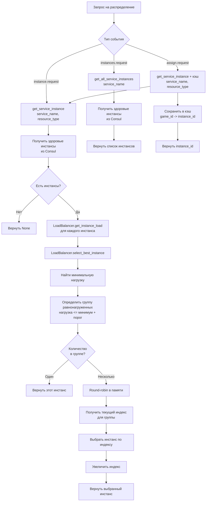

# Сервис распределения игр (Game Allocator Service)
[](README.md)

Сервис распределения игр отвечает за эффективное распределение игровых сессий по доступным экземплярам игровых серверов. Он использует метрики загрузки (CPU и RAM) игровых серверов, полученные из Prometheus, и консультируется с Consul для обнаружения здоровых экземпляров. Сервис взаимодействует через NATS для получения запросов на распределение игр и для публикации результатов.

## Назначение сервиса

Основная задача `game-allocator-service` — обеспечить балансировку нагрузки и оптимальное использование ресурсов игровых серверов путем интеллектуального выбора наименее загруженного экземпляра для новой игровой сессии. Сервис поддерживает универсальную систему распределения для любых сервисов (game-service, ai-service и будущих), используя проверку нагрузки через Prometheus и round-robin ротацию между равнонагруженными инстансами. Это критически важно для поддержания стабильной производительности и минимизации задержек в многопользовательской игре.

## Используемые технологии

*   **Python 3.12**: Язык программирования.
*   **`asyncio`**: Асинхронный ввод/вывод для высокопроизводительных сетевых операций.
*   **aiohttp**: Асинхронный HTTP-фреймворк для реализации healthcheck endpoint.
*   **NATS**: Легковесная, высокопроизводительная система обмена сообщениями, используемая для асинхронного взаимодействия между микросервисами.
*   **Prometheus API Client (`prometheus-api-client`)**: Для программного запроса метрик загрузки с Prometheus.
*   **Consul (`py-consul`)**: Для обнаружения сервисов и получения списка здоровых экземпляров игровых серверов.
*   **Redis (`redis`)**: Используется как кэш для хранения информации о распределенных игровых экземплярах (GameInstanceCache).
*   **Pydantic (`pydantic`, `pydantic-settings`)**: Для валидации данных и управления настройками конфигурации.
*   **Python JSON Logger (`python-json-logger`)**: Для структурированного логирования.
*   **UV**: Менеджер пакетов Python, используемый для установки зависимостей.

## Структура проекта

```
services/game-allocator-service/
├── app/
│   ├── __init__.py
│   ├── config.py             # Конфигурационные настройки сервиса
│   ├── game_cache.py         # Логика кэширования игровых экземпляров в Redis
│   ├── load_balancer.py      # Универсальный балансировщик нагрузки с round-robin ротацией
│   ├── logging_config.py     # Конфигурация логирования
│   ├── main.py               # Основная логика сервиса и точка входа
│   ├── nats_repository.py    # Взаимодействие с NATS
│   └── redis_repository.py   # Взаимодействие с Redis
├── tests/                    # Набор тестов
│   ├── README.md             # Документация по тестам (English)
│   ├── README_RU.md          # Документация по тестам (Russian)
│   ├── conftest.py           # Общие фикстуры и моки
│   └── test_*.py             # Файлы тестов
├── Dockerfile                # Определение Docker образа для сервиса
├── pyproject.toml            # Управление зависимостями проекта (через Poetry/uv)
├── README.md                 # Общие сведения о сервисе
├── README_RU.md              # Общие сведения о сервисе (Russian)
└── uv.lock                   # Файл блокировки зависимостей uv
```

## Архитектура распределения нагрузки

Сервис использует универсальную систему распределения нагрузки, которая работает для всех сервисов (game-service, ai-service и будущих). Система автоматически определяет группу равнонагруженных инстансов (в пределах порога ±LOAD_THRESHOLD) и использует round-robin ротацию для равномерного распределения запросов между ними.



## NATS-события и API-эндпоинты

Сервис `game-allocator-service` в основном взаимодействует через NATS-события. Он подписывается на запросы и публикует ответы. Также сервис предоставляет HTTP endpoint для проверки работоспособности. Обработчики событий регистрируются автоматически на основе конфигурации `SERVICE_CONFIGS`.

### HTTP Endpoints

*   **`GET /health`**:
    *   **Описание**: Endpoint для проверки работоспособности сервиса. Используется Consul для healthcheck.
    *   **Ответ (JSON)**:
        ```json
        {
            "status": "healthy",
            "service": "game-allocator-service"
        }
        ```

### Запросы

#### Распределение игр

*   **`game.assign.request`**:
    *   **Описание**: Запрос на распределение новой игровой сессии на игровой сервер. Использует LoadBalancer для выбора лучшего инстанса с учетом нагрузки и round-robin ротации.
    *   **Отправитель**: Обычно `webapi-service` или другой сервис, инициирующий новую игру.
    *   **Payload (JSON)**:

        ```json
        {
            "game_id": "<ID игры>",
            "settings": {
                "resource_level": "low" | "high" // Определяет, учитывать ли CPU (low) или RAM (high) при выборе сервера
            }
        }
        ```

#### Получение одного инстанса (с балансировкой нагрузки)

*   **`game.instance.request`**:
    *   **Описание**: Запрос на получение одного лучшего экземпляра `Game Service` с учетом нагрузки и round-robin ротации.
    *   **Отправитель**: Обычно `ai-service` или другие сервисы, которым нужен один инстанс для подключения.
    *   **Payload (JSON)**:

        ```json
        {
            "resource_type": "cpu" | "ram" // Тип ресурса для оптимизации (по умолчанию "cpu")
        }
        ```

*   **`ai.instance.request`**:
    *   **Описание**: Запрос на получение одного лучшего экземпляра `AI Service` с учетом нагрузки и round-robin ротации.
    *   **Отправитель**: Обычно `game-service` для подключения к AI сервису.
    *   **Payload (JSON)**:

        ```json
        {
            "resource_type": "cpu" | "ram" // Тип ресурса для оптимизации (по умолчанию "cpu")
        }
        ```

#### Получение всех инстансов

*   **`game.instances.request`**:
    *   **Описание**: Запрос на получение списка всех здоровых экземпляров `Game Service`.
    *   **Отправитель**: Обычно `webapi-service`, когда ему нужно агрегировать данные со всех экземпляров game-service (например, при получении списка всех игр).
    *   **Payload (JSON)**: Пустой объект `{}`

*   **`ai.instances.request`**:
    *   **Описание**: Запрос на получение списка всех здоровых экземпляров `AI Service`.
    *   **Отправитель**: Обычно другие сервисы, которым нужен полный список инстансов.
    *   **Payload (JSON)**: Пустой объект `{}`

### Ответы

#### Ответ на `game.assign.request`

После обработки запроса `game.assign.request`, сервис публикует ответ на тему, указанную в `msg.reply` NATS-сообщения.

*   **Payload (JSON)**:

    ```json
    {
        "success": true | false,
        "instance_id": "<IP-адрес или ID экземпляра игрового сервера>" // При успешном распределении
    }
    ```

#### Ответ на `*.instance.request`

После обработки запроса `game.instance.request` или `ai.instance.request`, сервис публикует ответ на тему, указанную в `msg.reply` NATS-сообщения.

*   **Payload (JSON)**:

    ```json
    {
        "success": true | false,
        "instance": {
            "address": "<IP-адрес или hostname>",
            "rest_port": 5002,
            "grpc_port": 50051
        } // Один лучший экземпляр сервиса с учетом нагрузки
    }
    ```

#### Ответ на `*.instances.request`

После обработки запроса `game.instances.request` или `ai.instances.request`, сервис публикует ответ на тему, указанную в `msg.reply` NATS-сообщения.

*   **Payload (JSON)**:

    ```json
    {
        "success": true | false,
        "instances": [
            {
                "address": "<IP-адрес или hostname>",
                "rest_port": 5002,
                "grpc_port": 50051
            }
        ] // Список всех здоровых экземпляров сервиса
    }
    ```

## Взаимодействие с другими сервисами

*   **Consul**: Используется для обнаружения всех зарегистрированных экземпляров сервисов (game-service, ai-service и других) и проверки их работоспособности. Также сервис регистрируется в Consul с HTTP healthcheck на endpoint `/health`, что позволяет Consul автоматически проверять работоспособность инстанса и исключать неработающие из доступных.
*   **Prometheus**: Запрашивает метрики загрузки (CPU, RAM) для каждого экземпляра сервисов для принятия решения о распределении. Использует универсальные PromQL запросы с именем сервиса.
*   **Redis**: Используется как кэш для временного хранения связи между `game_id` и `instance_id` (IP-адресом игрового сервера).
*   **NATS**: Основной канал связи для получения запросов на распределение игр и отправки ответов.
*   **Game Service и AI Service**: Являются целевыми сервисами, для которых `game-allocator-service` распределяет нагрузку. Взаимодействие непрямое, через Consul и Prometheus для мониторинга, и через NATS для запросов.

## Механизм балансировки нагрузки

Сервис использует универсальный класс `LoadBalancer` для распределения нагрузки:

1. **Получение метрик нагрузки**: Для каждого инстанса запрашиваются метрики CPU и RAM из Prometheus
2. **Определение равнонагруженных инстансов**: Инстансы считаются равнонагруженными, если разница их нагрузки не превышает `LOAD_THRESHOLD` (по умолчанию 2.0%)
3. **Выбор инстанса**:
   - Если только один инстанс → используется он
   - Если несколько равнонагруженных → используется round-robin ротация для равномерного распределения
   - Если разница нагрузки большая → выбирается наименее нагруженный
4. **Round-robin ротация**: Состояние ротации хранится в памяти сервиса. При каждом запросе выбирается следующий инстанс из группы равнонагруженных по кругу.

## Конфигурация сервисов

Сервисы настраиваются через `SERVICE_CONFIGS` в `config.py`. Это позволяет автоматически регистрировать обработчики для новых сервисов без изменения кода:

```python
SERVICE_CONFIGS = [
    {
        "service_name": "game-service",
        "instance_request_event": "game.instance.request",  # Запрос одного инстанса
        "instances_request_event": "game.instances.request",  # Запрос всех инстансов
        "assign_event": "game.assign.request",  # Распределение игры
    },
    {
        "service_name": "ai-service",
        "instance_request_event": "ai.instance.request",  # Запрос одного инстанса
        "instances_request_event": "ai.instances.request",  # Запрос всех инстансов
    },
]
```

Для добавления нового сервиса достаточно добавить запись в `SERVICE_CONFIGS`.

## Переменные окружения

Конфигурация сервиса управляется через переменные окружения, определенные в `app/config.py`.

*   `SERVICE_NAME`: Имя сервиса, по умолчанию `game-allocator-service`.
*   `APP_TITLE`: Заголовок приложения, по умолчанию `Bomberman Game Allocator Service`.
*   `PORT`: Порт для HTTP healthcheck endpoint, по умолчанию `5005`.
*   `GAME_CACHE_TTL`: Время жизни кэша для игровых экземпляров в секундах, по умолчанию `60`.
*   `LOAD_THRESHOLD`: Порог определения равнонагруженных инстансов (абсолютная разница в процентах), по умолчанию `2.0`. Инстансы считаются равнонагруженными, если разница их нагрузки не превышает это значение.
*   `SERVICE_CONFIGS`: Конфигурация сервисов для автоматической регистрации обработчиков (см. раздел "Конфигурация сервисов").
*   `REDIS_HOST`: Хост Redis, по умолчанию `localhost`.
*   `REDIS_PORT`: Порт Redis, по умолчанию `6379`.
*   `REDIS_DB`: База данных Redis, по умолчанию `0`.
*   `REDIS_PASSWORD`: Пароль для Redis (опционально).
*   `NATS_URL`: URL NATS сервера, по умолчанию `nats://localhost:4222`.
*   `PROMETHEUS_URL`: URL Prometheus сервера, по умолчанию `http://prometheus:9090`.
*   `CONSUL_HOST`: Хост Consul, по умолчанию `consul`.
*   `LOG_LEVEL`: Уровень логирования (DEBUG, INFO, WARNING, ERROR, CRITICAL), по умолчанию `DEBUG`.
*   `LOG_FORMAT`: Формат логирования (`text` или `json`), по умолчанию `text`.
*   `TRACE_CALLER`: Включать ли информацию о вызывающей стороне в логи, по умолчанию `True`.

## Управление секретами

Секреты хранятся в Infisical. Файл `.env-example` содержит все доступные переменные и может быть импортирован в Infisical как базовая конфигурация. Docker entrypoint входит в Infisical и запускает сервис с подставленными переменными окружения.

## Инструкции по запуску и развертыванию

### Локальный запуск (с Docker Compose)

1.  **Убедитесь, что Docker и Docker Compose установлены.**
2.  **Запустите все необходимые инфраструктурные сервисы через Docker Compose**: Перейдите в корневую директорию проекта (`BombermanOnline`) и выполните:
    ```bash
    docker-compose -f infra/docker-compose.yml up -d
    ```
    Это запустит Consul, Prometheus, NATS, Redis и другие сервисы, от которых зависит `game-allocator-service`.
3.  **Соберите и запустите `game-allocator-service`**: Перейдите в директорию сервиса:
    ```bash
    cd services/game-allocator-service
    ```
    Затем соберите Docker образ и запустите контейнер. В `Dockerfile` используется `uv` для установки зависимостей и запуска приложения.
    ```bash
    docker build -t game-allocator-service .
    docker run --network bombermanonline_default game-allocator-service
    ```
    *(Примечание: Сеть `bombermanonline_default` создается при запуске `infra/docker-compose.yml`)*

### Запуск в режиме разработки (без Docker)

1.  **Установите Python 3.12 и UV.**
2.  **Установите зависимости**: Перейдите в директорию `services/game-allocator-service` и выполните:
    ```bash
    uv sync
    ```
3.  **Запустите сервис**: Убедитесь, что все необходимые внешние сервисы (Consul, Prometheus, NATS, Redis) запущены и доступны с вашего хоста. Затем запустите:
    ```bash
    uv run app/main.py
    ```

### Развертывание

Сервис предназначен для развертывания в контейнерной среде (например, Docker, Kubernetes). `Dockerfile` предоставляет все необходимое для создания переносимого образа. Важно убедиться, что переменные окружения настроены правильно для производственной среды, особенно `CONSUL_HOST`, `PROMETHEUS_URL`, `NATS_URL`, `REDIS_HOST`.

## Тестирование

Сервис имеет комплексное покрытие тестами (99%), включая unit-тесты, интеграционные тесты и тесты производительности. Подробную информацию о запуске тестов, структуре тестов и покрытии кода см. в [Документации по тестам](tests/README_RU.md).

### Быстрый старт

```bash
# Установить зависимости для тестов
uv sync --group dev

# Запустить все тесты
uv run pytest

# Запустить тесты с отчетом о покрытии
uv run pytest --cov=app --cov-report=html
``` 