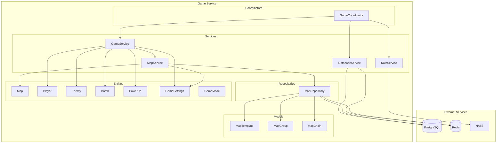
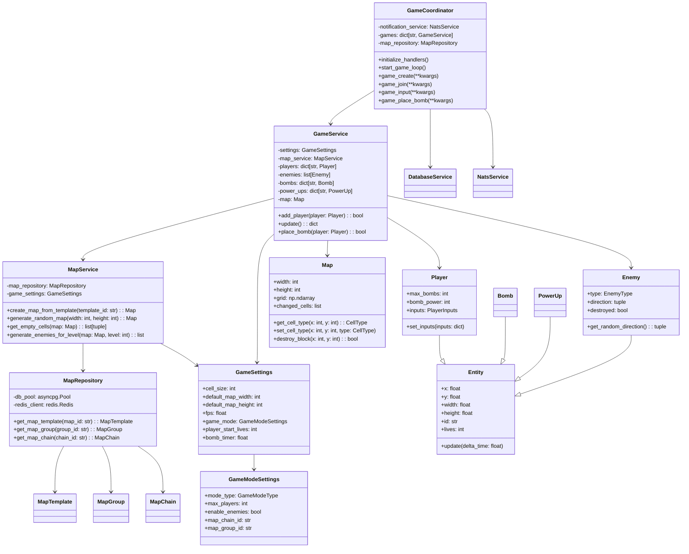
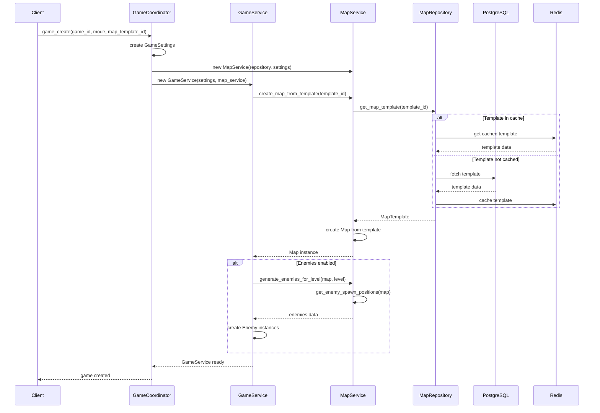
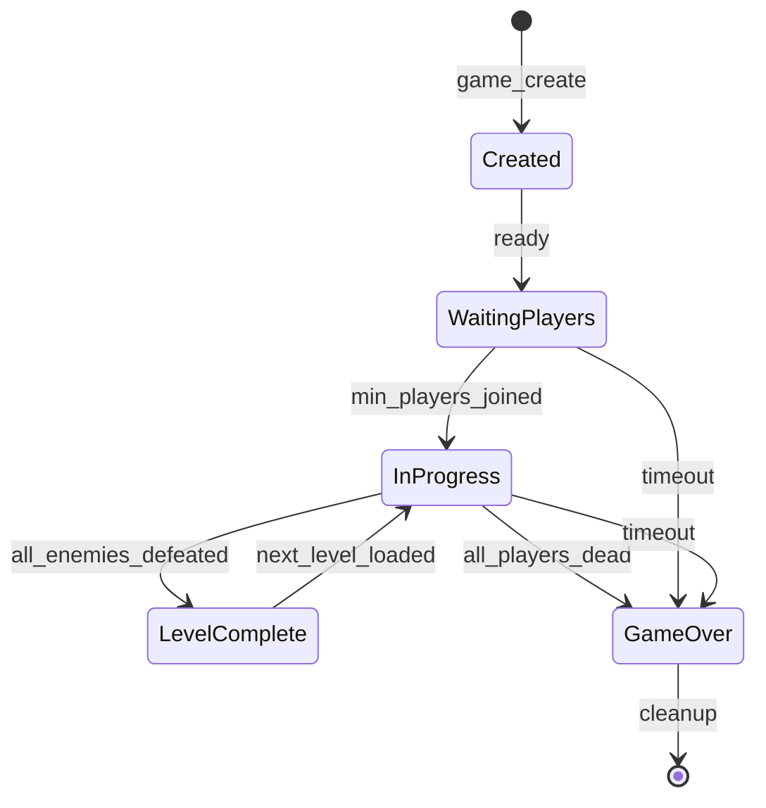

# Архитектура Game Service

## Диаграмма компонентов

## Диаграмма классов

## Диаграмма последовательности создания игры

## Диаграмма состояний игры

## Принципы архитектуры

### SOLID принципы

1. **Single Responsibility Principle (SRP)**
   - `MapService` отвечает только за управление картами
   - `GameService` - за игровую логику
   - `MapRepository` - за доступ к данным карт

2. **Open/Closed Principle (OCP)**
   - Новые игровые режимы добавляются через `GameModeType`
   - Новые типы сущностей наследуются от `Entity`

3. **Liskov Substitution Principle (LSP)**
   - Все игровые сущности наследуют от `Entity`
   - Могут использоваться взаимозаменяемо

4. **Interface Segregation Principle (ISP)**
   - Разделение интерфейсов для разных типов операций
   - Репозиторий не зависит от игровой логики

5. **Dependency Inversion Principle (DIP)**
   - `GameService` зависит от абстракции `MapService`
   - Инъекция зависимостей через конструкторы

### Чистая архитектура

- **Entities** - бизнес-сущности (Player, Enemy, Map)
- **Use Cases** - бизнес-логика (GameService, MapService)
- **Interface Adapters** - репозитории и контроллеры
- **Frameworks** - внешние зависимости (PostgreSQL, Redis, NATS)

### Разделение ответственности

- **GameCoordinator** - оркестрация игр и обработка событий
- **GameService** - основная игровая логика
- **MapService** - генерация и управление картами
- **MapRepository** - доступ к данным карт
- **DatabaseService** - управление подключениями к БД