# Диаграмма REST API Endpoints

Эта диаграмма показывает структуру REST API endpoints для управления играми, командами и картами в Game Service.

```mermaid
graph TB
    subgraph "Game Service REST API"
        subgraph "Games API (/games)"
            G1[GET /games/]
            G2[GET /games/ID] 
            G3[POST /games/]
            G4[PUT /games/ID/settings]
            G5[PUT /games/ID/status]
            G6[POST /games/ID/players]
            G7[DELETE /games/ID/players/PLAYER_ID]
            G8[DELETE /games/ID]
        end

        subgraph "Teams API (/teams)"
            T1[GET /teams/GAME_ID]
            T2[POST /teams/GAME_ID]
            T3[PUT /teams/GAME_ID/TEAM_ID]
            T4[DELETE /teams/GAME_ID/TEAM_ID]
            T5[POST /teams/GAME_ID/TEAM_ID/players]
            T6[DELETE /teams/GAME_ID/TEAM_ID/players/PLAYER_ID]
            T7[POST /teams/GAME_ID/distribute]
            T8[GET /teams/GAME_ID/validate]
        end

        subgraph "Maps API (/maps)"
            M1[POST /templates]
            M2[GET /templates]
            M3[GET /templates/ID]
            M4[PUT /templates/ID]
            M5[DELETE /templates/ID]
            M6[POST /groups]
            M7[GET /groups]
            M8[GET /groups/ID]
            M9[POST /chains]
            M10[GET /chains]
            M11[GET /chains/ID]
        end

        subgraph "Core Services"
            GC[GameCoordinator]
            GS[GameService]
            TS[TeamService]
            MR[MapRepository]
        end
    end

    subgraph "Client Applications"
        WEB[Web Frontend]
        API[WebAPI Service]
        MOBILE[Mobile Apps]
    end

    subgraph "External Services"
        NATS[NATS Server]
        DB[(PostgreSQL)]
        REDIS[(Redis Cache)]
    end

    %% API Flow connections
    G1 --> GC
    G2 --> GC
    G3 --> GC
    G4 --> GC
    G5 --> GC
    G6 --> GC
    G7 --> GC
    G8 --> GC

    T1 --> TS
    T2 --> TS
    T3 --> TS
    T4 --> TS
    T5 --> TS
    T6 --> TS
    T7 --> TS
    T8 --> TS

    M1 --> MR
    M2 --> MR
    M3 --> MR
    M4 --> MR
    M5 --> MR
    M6 --> MR
    M7 --> MR
    M8 --> MR
    M9 --> MR
    M10 --> MR
    M11 --> MR

    %% Service connections
    GC --> GS
    GS --> TS
    MR --> DB
    MR --> REDIS

    %% Client connections
    WEB --> G1
    WEB --> G2
    WEB --> G3
    API --> G1
    API --> G3
    MOBILE --> G1
    MOBILE --> G2

    %% Real-time communication
    GC --> NATS
    NATS --> WEB
    NATS --> MOBILE

    classDef apiEndpoint fill:#e1f5fe,stroke:#01579b,stroke-width:2px
    classDef service fill:#f3e5f5,stroke:#4a148c,stroke-width:2px
    classDef client fill:#e8f5e8,stroke:#2e7d32,stroke-width:2px
    classDef external fill:#fff3e0,stroke:#e65100,stroke-width:2px

    class G1,G2,G3,G4,G5,G6,G7,G8,T1,T2,T3,T4,T5,T6,T7,T8,M1,M2,M3,M4,M5,M6,M7,M8,M9,M10,M11 apiEndpoint
    class GC,GS,TS,MR service
    class WEB,API,MOBILE client
    class NATS,DB,REDIS external
```

**Описание потоков данных:**

1. **Управление играми**: Клиенты используют Games API для создания, настройки и управления игровыми сессиями
2. **Командная система**: Teams API позволяет управлять командами и распределением игроков
3. **Карты**: Maps API управляет шаблонами, группами и цепочками карт
4. **Реальное время**: NATS обеспечивает обмен сообщениями в реальном времени для игровых событий
5. **Персистентность**: PostgreSQL хранит данные, Redis обеспечивает кеширование 