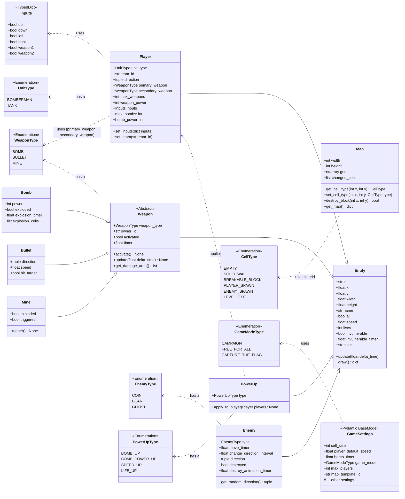

# Class Diagram (Core Entities)

This diagram illustrates the main game entity classes and their relationships in `game-service`.

**Notation:**
-   `<|--`: Inheritance (e.g., `Player` inherits from `Entity`).
-   `..>`: Association or dependency (e.g., `Player` uses `Inputs`).
-   `<<Abstract>>`: Abstract class.
-   `<<Enumeration>>`: Enumeration.
-   `<<TypedDict>>`: Typed dictionary.
-   `<<Pydantic BaseModel>>`: Pydantic model.
