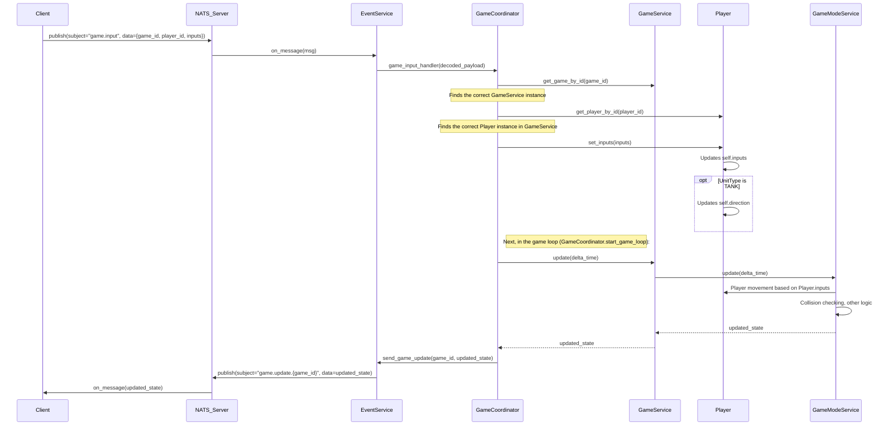

# Sequence Diagram: `game.input` Processing

This diagram shows the sequence of calls and interactions between components when processing the `game.input` NATS event.

**Steps Description:**

1.  **Client** publishes a `game.input` message to **NATS_Server**. The message contains `game_id`, `player_id`, and the state of input buttons (`inputs`).
2.  **NATS_Server** delivers this message to the subscriber — **EventService**.
3.  **EventService** receives the raw message, decodes its JSON content, and calls the corresponding handler in **GameCoordinator** (`game_input_handler`).
4.  **GameCoordinator** finds the correct **GameService** instance (managing a specific game session) by `game_id`.
5.  **GameCoordinator** finds the **Player** object within this **GameService** by `player_id`.
6.  **GameCoordinator** calls the `player.set_inputs(inputs)` method, passing the new button states.
7.  The **Player** object updates its internal `self.inputs` state. If the player is of type `TANK`, its `self.direction` attribute is also updated based on the movement buttons (up, down, left, right).
8.  Next, within the main game loop (`start_game_loop` in **GameCoordinator**), which runs periodically:
    -   **GameCoordinator** calls `update(delta_time)` on the corresponding **GameService**.
    -   **GameService** delegates the `update(delta_time)` call to its current **GameModeService**.
    -   **GameModeService** processes the update logic, including:
        -   Moving the **Player** object based on its updated `Player.inputs` and `Player.direction` state.
        -   Checking for collisions, applying physics, and other game logic.
    -   **GameModeService** returns the updated game state to **GameService**.
    -   **GameService** returns it to **GameCoordinator**.
9.  **GameCoordinator**, via **EventService**, publishes a `game.update.{game_id}` event to **NATS_Server** with the full updated game state.
10. **NATS_Server** delivers this update to all subscribed **Clients**.
