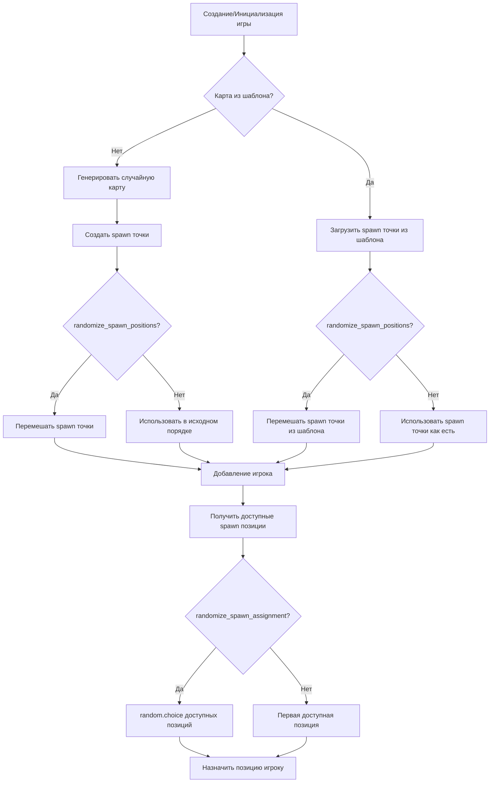

# Flow Diagram: Spawn Points Randomization System

This diagram describes the process of creating and distributing spawn points for players in Game Service.

## Flow Diagram

## Process Description

### 1. Map Initialization

When creating or initializing a game, the system determines the map source:
- **Template Map**: Spawn points are loaded from a saved map template
- **Random Map**: Spawn points are generated dynamically based on placement algorithm

### 2. Spawn Points Randomization

If the `randomize_spawn_positions` setting is enabled (`True`):
- For random maps: The list of priority positions is shuffled before placing spawn points on the map
- For template maps: The list of spawn points from the template is shuffled before use

If the setting is disabled (`False`):
- Spawn points are used in their original order (deterministically)

### 3. Player Distribution

When adding a player to the game:
1. The system gets all available spawn positions (excluding already occupied ones)
2. Depending on the `randomize_spawn_assignment` setting:
   - **Enabled (`True`)**: Uses `random.choice()` for random position selection
   - **Disabled (`False`)**: Assigns the first available position from the list

### 4. Settings Application

Randomization settings are applied in the following scenarios:
- When creating a new game
- When adding a player to the game
- When transitioning between levels in Campaign mode
- In training mode (TrainingCoordinator)

## Benefits of Randomization

- **Gameplay Variety**: Players spawn in different locations on each new start
- **Balance**: Prevents advantage for players who always know their starting position
- **AI Training**: In training mode, helps the model learn under various starting conditions

