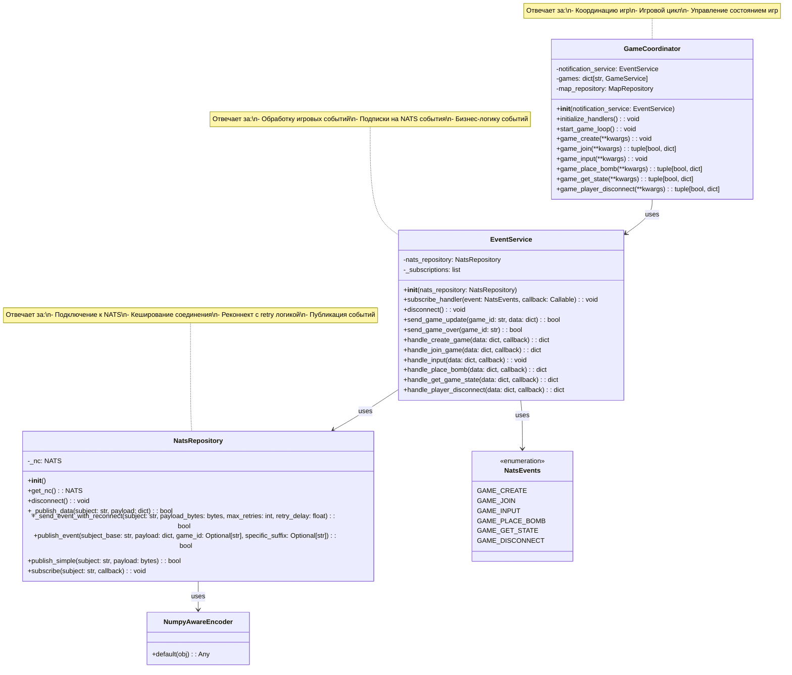

# Архитектура NATS в Game Service

## Обзор

Данный документ описывает архитектуру работы с NATS в game-service после рефакторинга. Основные изменения:

1. **Разделение ответственности**: Логика подключения к NATS вынесена в `NatsRepository`
2. **Реконнект логика**: Добавлена надежная система переподключения с экспоненциальным backoff
3. **Событийная архитектура**: `NatsService` переименован в `EventService` для лучшего отражения назначения

## UML диаграмма архитектуры



## Основные компоненты

### NatsRepository

**Назначение**: Низкоуровневая работа с NATS соединением

**Ключевые особенности**:
- Кеширование соединения
- Автоматический реконнект с retry логикой
- Экспоненциальный backoff при ошибках
- Сериализация данных с поддержкой NumPy типов

**Методы**:
- `get_nc()`: Получение соединения с автоматическим подключением
- `publish_event()`: Удобная публикация событий с построением топика
- `_send_event_with_reconnect()`: Публикация с retry логикой

### EventService

**Назначение**: Обработка игровых событий и управление подписками

**Ключевые особенности**:
- Абстракция над NATS для игровых событий
- Обработка различных типов игровых команд
- Автоматическая сериализация ответов

**События**:
- `GAME_CREATE`: Создание новой игры
- `GAME_JOIN`: Присоединение к игре
- `GAME_INPUT`: Ввод игрока
- `GAME_PLACE_BOMB`: Размещение бомбы
- `GAME_GET_STATE`: Получение состояния игры
- `GAME_DISCONNECT`: Отключение игрока

### GameCoordinator

**Назначение**: Координация игрового процесса

**Ключевые особенности**:
- Управление жизненным циклом игр
- Обработка игровых команд через EventService
- Игровой цикл с отправкой обновлений

## Преимущества новой архитектуры

1. **Разделение ответственности**: Четкое разделение между транспортом (NATS) и бизнес-логикой
2. **Надежность**: Автоматический реконнект с retry логикой
3. **Тестируемость**: Возможность мокирования NatsRepository для тестов
4. **Расширяемость**: Легко добавлять новые типы событий
5. **Производительность**: Кеширование соединений и оптимизированная сериализация

## Конфигурация

Retry логика настраивается через параметры:
- `max_retries`: Максимальное количество попыток (по умолчанию 3)
- `retry_delay`: Базовая задержка между попытками (по умолчанию 1.0 сек)
- Экспоненциальный backoff: `retry_delay * (attempt + 1)`

## Использование

```python
# Инициализация
nats_repository = NatsRepository()
event_service = EventService(nats_repository=nats_repository)
game_coordinator = GameCoordinator(notification_service=event_service)

# Инициализация обработчиков
await game_coordinator.initialize_handlers()

# Публикация событий
await event_service.send_game_update(game_id="123", data={"state": "active"})

# Отключение
await event_service.disconnect()
``` 