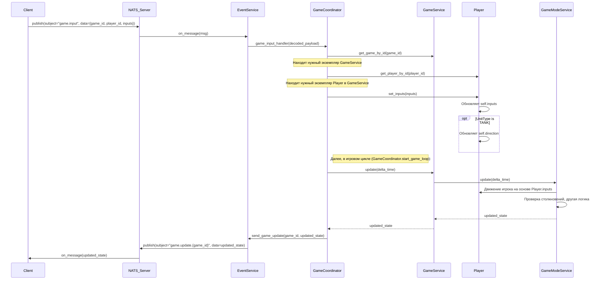

# Диаграмма Последовательности: Обработка `game.input`

Эта диаграмма показывает последовательность вызовов и взаимодействий компонентов при обработке NATS-события `game.input`.

**Описание шагов:**

1.  **Клиент** публикует сообщение `game.input` в **NATS_Server**. Сообщение содержит `game_id`, `player_id` и состояние кнопок ввода (`inputs`).
2.  **NATS_Server** доставляет это сообщение подписчику — **EventService**.
3.  **EventService** получает сырое сообщение, декодирует его JSON-содержимое и вызывает соответствующий обработчик в **GameCoordinator** (`game_input_handler`).
4.  **GameCoordinator** по `game_id` находит нужный экземпляр **GameService** (управляющий конкретной игровой сессией).
5.  **GameCoordinator** по `player_id` находит объект **Player** внутри этого **GameService**.
6.  **GameCoordinator** вызывает метод `player.set_inputs(inputs)`, передавая новые состояния кнопок.
7.  Объект **Player** обновляет свое внутреннее состояние `self.inputs`. Если игрок типа `TANK`, также обновляется его атрибут `self.direction` на основе нажатых клавиш движения (вверх, вниз, влево, вправо).
8.  Далее, в рамках основного игрового цикла (`start_game_loop` в **GameCoordinator**), который выполняется периодически:
    -   **GameCoordinator** вызывает `update(delta_time)` у соответствующего **GameService**.
    -   **GameService** делегирует вызов `update(delta_time)` своему текущему **GameModeService**.
    -   **GameModeService** обрабатывает логику обновления, включая:
        -   Перемещение объекта **Player** на основе его обновленного состояния `Player.inputs` и `Player.direction`.
        -   Проверку столкновений, применение физики и другую игровую логику.
    -   **GameModeService** возвращает обновленное состояние игры в **GameService**.
    -   **GameService** возвращает его в **GameCoordinator**.
9.  **GameCoordinator** через **EventService** публикует событие `game.update.{game_id}` в **NATS_Server** с полным обновленным состоянием игры.
10. **NATS_Server** доставляет это обновление всем подписанным **Клиентам**.