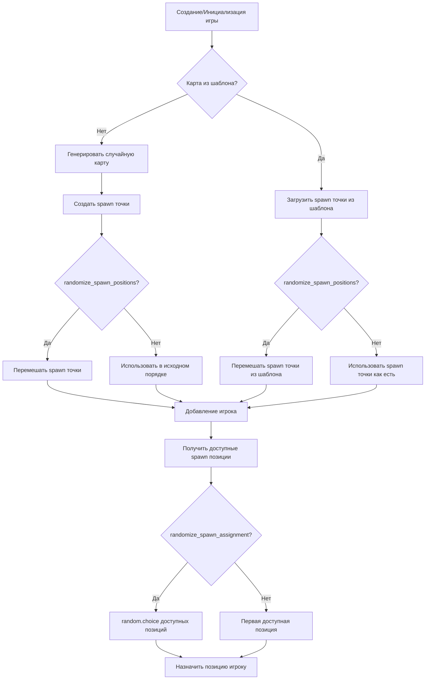

# Диаграмма потока: Система рандомизации spawn точек

Эта диаграмма описывает процесс создания и распределения spawn точек для игроков в Game Service.

## Диаграмма потока

## Описание процесса

### 1. Инициализация карты

При создании или инициализации игры система определяет источник карты:
- **Карта из шаблона**: Spawn точки загружаются из сохраненного шаблона карты
- **Случайная карта**: Spawn точки генерируются динамически на основе алгоритма размещения

### 2. Рандомизация spawn точек

Если настройка `randomize_spawn_positions` включена (`True`):
- Для случайных карт: список приоритетных позиций перемешивается перед размещением spawn точек на карте
- Для шаблонов карт: список spawn точек из шаблона перемешивается перед использованием

Если настройка выключена (`False`):
- Spawn точки используются в исходном порядке (детерминированно)

### 3. Распределение игроков

При добавлении игрока в игру:
1. Система получает все доступные spawn позиции (исключая уже занятые)
2. В зависимости от настройки `randomize_spawn_assignment`:
   - **Включено (`True`)**: Используется `random.choice()` для случайного выбора позиции
   - **Выключено (`False`)**: Назначается первая доступная позиция из списка

### 4. Применение настроек

Настройки рандомизации применяются в следующих сценариях:
- При создании новой игры
- При добавлении игрока в игру
- При переходе между уровнями в режиме Campaign
- В тренировочном режиме (TrainingCoordinator)

## Преимущества рандомизации

- **Разнообразие игрового опыта**: Игроки появляются в разных местах при каждом новом старте
- **Балансировка**: Предотвращает преимущество игроков, которые всегда знают свою стартовую позицию
- **Обучение AI**: В тренировочном режиме помогает модели обучаться на различных стартовых условиях

