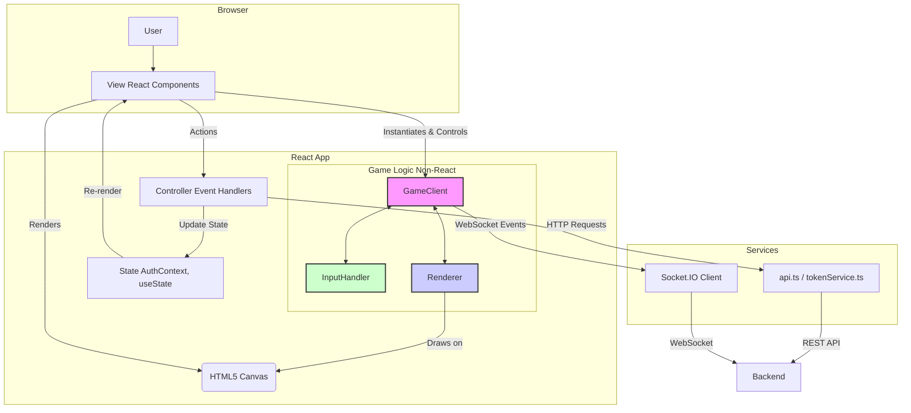

# Architecture (Detailed Overview)

This document provides a comprehensive technical description of the web frontend service's architecture. It is based on a detailed analysis of the source code and describes each key component, its internal logic, and its interaction with other parts of the system.

## 1. Overall Structure and Entry Point

The application is initialized in `src/index.tsx`. It mounts the root `App` component into the DOM and wraps it in the following providers:

*   **`BrowserRouter`**: Enables routing based on the HTML5 History API.
*   **`AuthProvider`**: Provides an authentication context for the entire application.

## 2. Routing (`src/App.tsx`)

The `App.tsx` component defines the entire application's route structure using `react-router-dom`.

*   **`ThemeProvider`**: Wraps the entire application, providing a unified theme from Material-UI.
*   **Public Routes**: `/`, `/account/login`, `/account/register`, etc., are wrapped in the `PublicRoute` component, which is only accessible to unauthenticated users.
*   **Protected Routes**: `/account/dashboard`, `/account/profile`, etc., are wrapped in `ProtectedRoute`, which requires authentication.
*   **Game Route (`/account/game/:gameId`)**: It is handled separately as it uses a special `Layout` without padding and with additional game information in the header.
*   **`GameManagementWrapper`**: A helper component that extracts `gameId` from the URL and passes it to `ManageGame` as a prop. This is necessary because `useParams` only works in components rendered inside `Routes`.

## 3. Authentication State Management (`src/context/AuthContext.tsx`)

`AuthProvider` is the central hub for managing the user's session.

*   **State**: Stores `user`, `isAuthenticated`, and `loading`.
*   **`useEffect` (check on startup)**: When the application loads, it performs an asynchronous check:
    1.  Checks for the presence of tokens in `tokenService`.
    2.  If tokens exist, it executes a `GET /users/me` request to `authApi` to fetch user data.
    3.  If the request is successful, it sets `isAuthenticated = true` and the `user`.
    4.  If the request fails (e.g., the token has expired), it tries to refresh the token via `tokenService.refreshToken()`.
    5.  If the refresh is successful, it retries the request for user data.
    6.  If the refresh fails, it clears the tokens and sets `isAuthenticated = false`.
*   **Methods**: Provides functions like `login`, `register`, `logout`, `updateProfile`, etc., that encapsulate the logic for API requests and state updates.

## 4. API Interaction (`src/services/api.ts` and `src/services/tokenService.ts`)

### 4.1. `tokenService.ts`

This service is a low-level token handler.

*   **Storage**: Saves `access_token` and `refresh_token` in `localStorage`.
*   **Cookie for WebSocket**: When saving tokens, `tokenService` also creates a **cookie** named `ws_auth_token`. This is a key aspect for authenticating the WebSocket connection, as `socket.io-client` automatically sends cookies when establishing a connection.
*   **Cleanup**: On logout or token error, it removes the tokens from `localStorage` and the corresponding cookie.

### 4.2. `api.ts`

Here, `axios` instances are created and configured.

*   **`createAxiosInstance`**: A factory function that creates an `axios` instance with a base URL.
*   **Request Interceptor**: Before each HTTP request, it automatically adds the `Authorization: Bearer {access_token}` header, extracting the token from `localStorage`.
*   **Response Interceptor**: Handles response errors.
    *   If the server returns **`401 Unauthorized`**, the interceptor automatically attempts to refresh the token using `tokenService.refreshToken()`.
    *   If successful, the original request is retried with the new token.
    *   If it fails, all tokens are cleared, and the user is redirected to the login page.
*   **`getProxiedGameApi(gameId)`**: A special function that creates an `axios` instance for interacting with the `Game Service` via a proxy in the `WebAPI Service`. It automatically adds `game_id` to the parameters of each request, which is necessary for routing on the backend.

## 5. Game Client (Detailed Breakdown of `GameClient.ts`)

`GameClient` is the brain of the entire client-side game process. It is not a React component but a class that manages logic.

### 5.1. Initialization

*   Upon creation, it receives the `<canvas>`, `entitiesInfo` (entity parameters), and `playerId`.
*   It initializes `socket.io-client`, connecting to the URL from `process.env.REACT_APP_SOCKET_URL`.
*   It creates instances of `InputHandler` and `Renderer`.

### 5.2. WebSocket Connection Management

`setupSocketEvents` defines handlers for all key socket events:

*   **`connect`**: Sets the `isConnected = true` flag.
*   **`disconnect`**: Sets `isConnected = false` and displays a disconnect message on the canvas.
*   **`connect_error`**: Logs the error. If the error message contains "Authentication" or "Unauthorized", it calls `handleAuthError` to attempt a token refresh.
*   **`auth_error`**: An explicit event from the server about an authorization error, which also calls `handleAuthError`.
*   **`game_state`**: Receives the **full** game state. This usually happens once upon joining. `processFullGameStateUpdate` saves this state.
*   **`game_update`**: Receives **partial** state changes (a delta). `processGameStateUpdate` applies these changes to the local state, which is much more efficient than receiving the full state every time.
*   **`game_over`**: Shows the game over screen.

### 5.3. Game Loop (`startGameLoop`)

*   Uses `requestAnimationFrame` to create a continuous loop.
*   In each frame:
    1.  Calls `sendInputs()` to send the current input state to the server.
    2.  Calls `update()` for rendering.

### 5.4. Rendering Logic (`update` and `Renderer.ts`)

*   **`update()` in `GameClient`**:
    *   Checks if more than 3 seconds have passed since the last update and, if so, forcibly requests the full game state (`requestGameState`) to avoid desynchronization.
    *   If the game state (`this.gameState`) and the map (`this.cachedMapGrid`) exist, it calls `this.renderer.render(this.gameState, this.playerId)`.
*   **`Renderer.ts`**:
    *   **Smooth Camera**: `calculateViewOffsetWithDeadZone` calculates the camera offset. The camera only moves if the player goes beyond a "dead zone" in the center of the screen.
    *   **Layered Rendering**: Sequentially renders the background, map section, power-ups, weapons, enemies, and players. This ensures the correct Z-index for objects.
    *   **Optimization**: Renders only the objects that are within the visible area (`isObjectVisible`).

## 6. Input Handling (`src/services/InputHandler.ts`)

A simple class that listens for global `keydown` and `keyup` events. It contains a private `input` property (an object with boolean flags: `up`, `down`, `left`, `right`, `weapon1`). In each game loop tick, `GameClient` calls `getInput()` and sends the result to the server.

### Frontend Architecture Diagram

