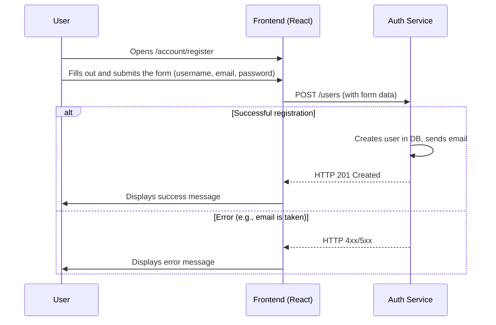
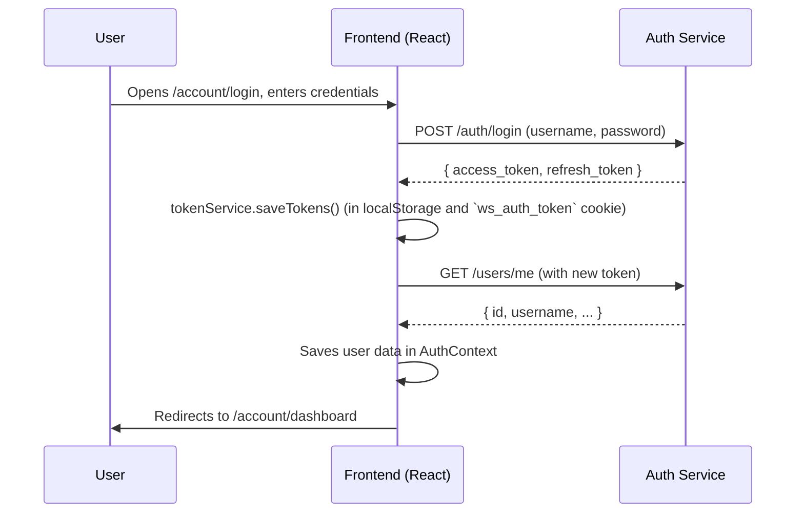
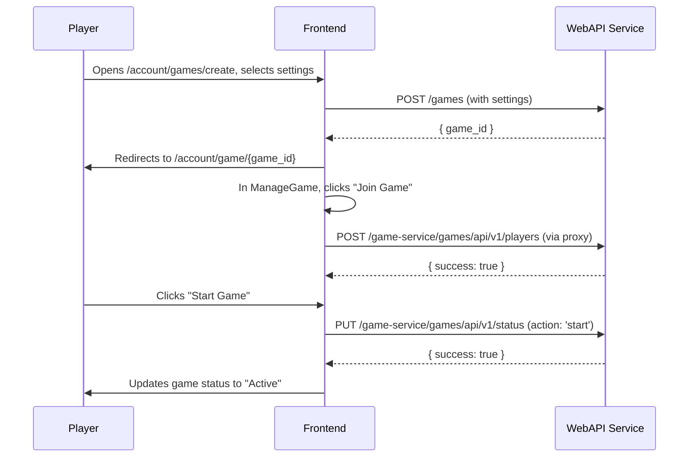
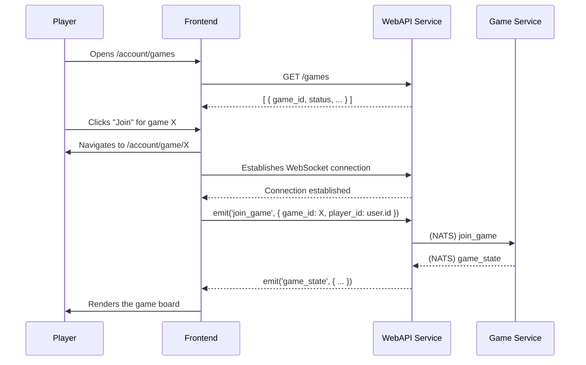
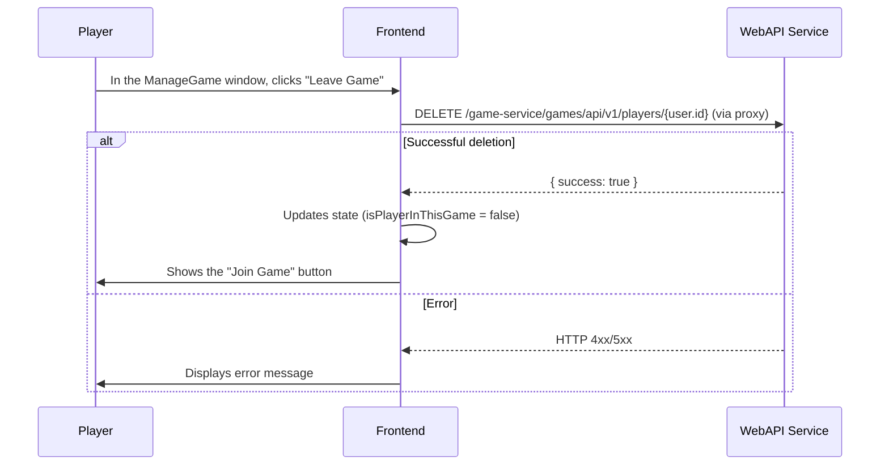
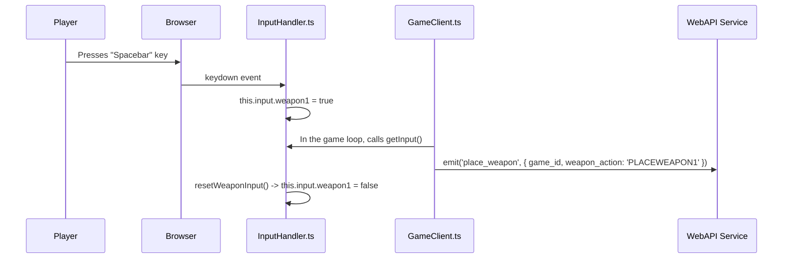
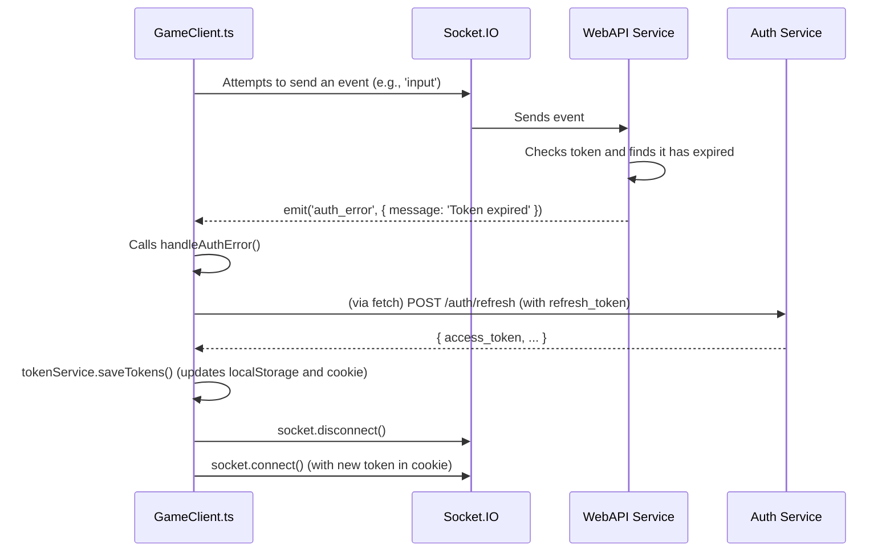
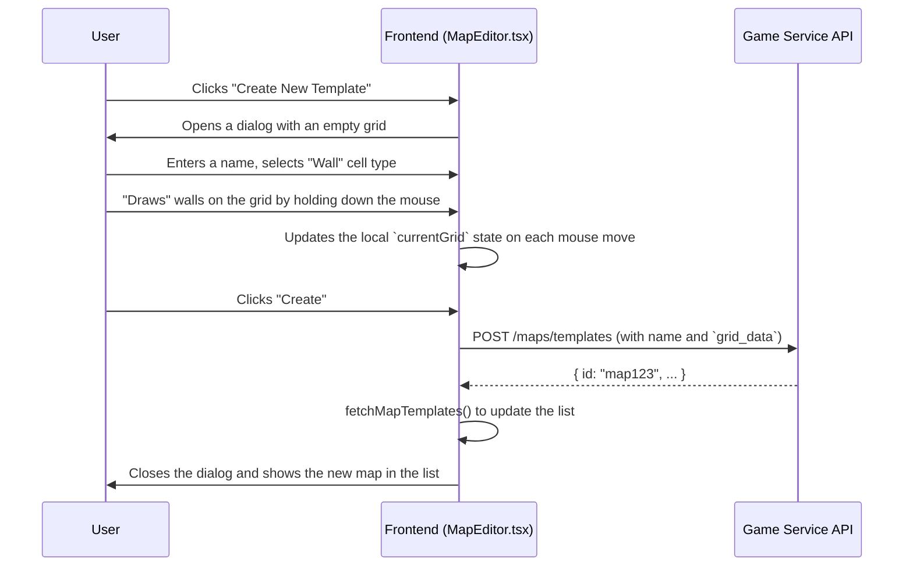

# Use Cases (Detailed Overview)

This document describes the key user interaction scenarios with the system, illustrating them with detailed sequence diagrams.

## 1. Authentication

### UC-1: New User Registration

*   **Description:** A new user creates an account.

### UC-2: Logging In

*   **Description:** A registered user logs into their account.

## 2. Game Management

### UC-3: Creating and Starting a Game

*   **Description:** A player creates a game, joins it, and starts it.

### UC-4: Joining a Game from the List

*   **Description:** A player sees a list of games and joins one of them.

### UC-5: Player Leaves Game

*   **Description:** A player in the lobby decides to leave the game.

## 3. Gameplay

### UC-6: Placing a Bomb

*   **Description:** The player presses the spacebar to place a bomb.

### UC-7: Automatic Token Refresh In-Game

*   **Description:** The player's `accessToken` expires during the game. The client must refresh it seamlessly without interrupting gameplay.

## 4. Map Editor

### UC-8: Creating and Saving a Map Template

*   **Description:** A user creates a new map template using the interactive editor.

