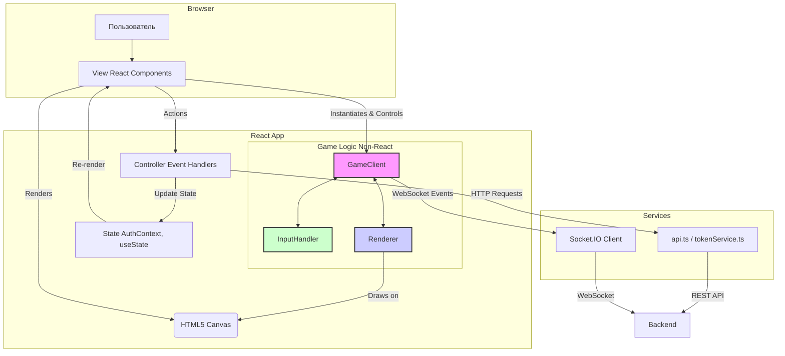

# Архитектура (Детальный обзор)

Этот документ предоставляет исчерпывающее техническое описание архитектуры веб-фронтенд сервиса. Он основан на детальном анализе исходного кода и описывает каждый ключевой компонент, его внутреннюю логику и взаимодействие с другими частями системы.

## 1. Общая структура и точка входа

Приложение инициализируется в `src/index.tsx`. Он монтирует корневой компонент `App` в DOM и оборачивает его в следующие провайдеры:

*   **`BrowserRouter`**: Включает маршрутизацию на основе HTML5 History API.
*   **`AuthProvider`**: Предоставляет контекст аутентификации для всего приложения.

## 2. Маршрутизация (`src/App.tsx`)

Компонент `App.tsx` определяет всю структуру маршрутов приложения с помощью `react-router-dom`.

*   **`ThemeProvider`**: Оборачивает все приложение, предоставляя единую тему оформления от Material-UI.
*   **Публичные маршруты**: `/`, `/account/login`, `/account/register`, и т.д. обернуты в компонент `PublicRoute`, который доступен только неавторизованным пользователям.
*   **Защищенные маршруты**: `/account/dashboard`, `/account/profile`, и т.д. обернуты в `ProtectedRoute`, который требует аутентификации.
*   **Игровой маршрут (`/account/game/:gameId`)**: Вынесен отдельно, так как использует особый `Layout` без отступов и с дополнительной игровой информацией в шапке.
*   **`GameManagementWrapper`**: Вспомогательный компонент, который извлекает `gameId` из URL и передает его в `ManageGame` как prop. Это необходимо, так как `useParams` работает только в компонентах, отрендеренных внутри `Routes`.

## 3. Управление состоянием аутентификации (`src/context/AuthContext.tsx`)

`AuthProvider` — это центральный узел для управления сессией пользователя.

*   **Состояние**: Хранит `user`, `isAuthenticated` и `loading`.
*   **`useEffect` (проверка при запуске)**: При загрузке приложения выполняет асинхронную проверку:
    1.  Проверяет наличие токенов в `tokenService`.
    2.  Если токены есть, выполняет запрос `GET /users/me` к `authApi` для получения данных о пользователе.
    3.  Если запрос успешен, устанавливает `isAuthenticated = true` и `user`.
    4.  Если запрос провалился (например, токен истек), пытается обновить токен через `tokenService.refreshToken()`.
    5.  Если обновление успешно, повторяет запрос за данными пользователя.
    6.  Если обновление провалилось, очищает токены и устанавливает `isAuthenticated = false`.
*   **Методы**: Предоставляет функции `login`, `register`, `logout`, `updateProfile` и др., которые инкапсулируют логику API-запросов и обновления состояния.

## 4. Взаимодействие с API (`src/services/api.ts` и `src/services/tokenService.ts`)

### 4.1. `tokenService.ts`

Этот сервис — низкоуровневый обработчик токенов.

*   **Хранение**: Сохраняет `access_token` и `refresh_token` в `localStorage`.
*   **Cookie для WebSocket**: При сохранении токенов, `tokenService` также создает **cookie** с именем `ws_auth_token`. Это ключевой момент для аутентификации WebSocket-соединения, так как `socket.io-client` автоматически отправляет cookie при установке соединения.
*   **Очистка**: При выходе из системы или ошибке токена удаляет токены из `localStorage` и соответствующую cookie.

### 4.2. `api.ts`

Здесь создаются и настраиваются экземпляры `axios`.

*   **`createAxiosInstance`**: Фабричная функция, которая создает экземпляр `axios` с базовым URL.
*   **Перехватчик запросов (Request Interceptor)**: Перед каждым HTTP-запросом автоматически добавляет заголовок `Authorization: Bearer {access_token}`, извлекая токен из `localStorage`.
*   **Перехватчик ответов (Response Interceptor)**: Обрабатывает ошибки ответов.
    *   Если сервер возвращает **`401 Unauthorized`**, перехватчик автоматически пытается обновить токен с помощью `tokenService.refreshToken()`.
    *   В случае успеха, исходный запрос повторяется с новым токеном.
    *   В случае неудачи, все токены очищаются, и пользователь перенаправляется на страницу входа.
*   **`getProxiedGameApi(gameId)`**: Специальная функция, которая создает экземпляр `axios` для взаимодействия с `Game Service` через прокси в `WebAPI Service`. Она автоматически добавляет `game_id` в параметры каждого запроса, что необходимо для маршрутизации на бэкенде.

## 5. Игровой клиент (Детальный разбор `GameClient.ts`)

`GameClient` — это мозг всего игрового процесса на клиенте. Он не является React-компонентом, а представляет собой класс, управляющий логикой.

### 5.1. Инициализация

*   При создании получает `<canvas>`, `entitiesInfo` (параметры сущностей) и `playerId`.
*   Инициализирует `socket.io-client`, подключаясь к URL из `process.env.REACT_APP_SOCKET_URL`.
*   Создает экземпляры `InputHandler` и `Renderer`.

### 5.2. Управление WebSocket-соединением

`setupSocketEvents` определяет обработчики для всех ключевых событий сокета:

*   **`connect`**: Устанавливает флаг `isConnected = true`.
*   **`disconnect`**: Устанавливает `isConnected = false` и показывает на canvas сообщение о дисконнекте.
*   **`connect_error`**: Логирует ошибку. Если ошибка содержит "Authentication" или "Unauthorized", вызывает `handleAuthError` для попытки обновления токена.
*   **`auth_error`**: Явное событие от сервера об ошибке авторизации, также вызывает `handleAuthError`.
*   **`game_state`**: Получает **полное** состояние игры. Это происходит обычно один раз при присоединении. `processFullGameStateUpdate` сохраняет это состояние.
*   **`game_update`**: Получает **частичные** изменения состояния (дельту). `processGameStateUpdate` применяет эти изменения к локальному состоянию, что гораздо эффективнее, чем получать полное состояние каждый раз.
*   **`game_over`**: Показывает экран окончания игры.

### 5.3. Игровой цикл (`startGameLoop`)

*   Использует `requestAnimationFrame` для создания непрерывного цикла.
*   В каждом кадре:
    1.  Вызывает `sendInputs()` для отправки текущего состояния ввода на сервер.
    2.  Вызывает `update()` для отрисовки.

### 5.4. Логика отрисовки (`update` и `Renderer.ts`)

*   **`update()` в `GameClient`**: 
    *   Проверяет, если с момента последнего обновления прошло более 3 секунд, принудительно запрашивает полное состояние игры (`requestGameState`), чтобы избежать рассинхронизации.
    *   Если состояние игры (`this.gameState`) и карта (`this.cachedMapGrid`) существуют, вызывает `this.renderer.render(this.gameState, this.playerId)`.
*   **`Renderer.ts`**: 
    *   **Плавная камера**: `calculateViewOffsetWithDeadZone` вычисляет смещение камеры. Камера движется, только если игрок выходит за пределы "мертвой зоны" в центре экрана.
    *   **Отрисовка по слоям**: Последовательно отрисовывает фон, секцию карты, бонусы, оружие, врагов и игроков. Это обеспечивает правильный Z-индекс объектов.
    *   **Оптимизация**: Рендерит только те объекты, которые попадают в видимую область (`isObjectVisible`).

## 6. Обработка ввода (`src/services/InputHandler.ts`)

Простой класс, который слушает глобальные события `keydown` и `keyup`. Он содержит приватное свойство `input` (объект с boolean-флагами: `up`, `down`, `left`, `right`, `weapon1`). `GameClient` в каждом тике игрового цикла вызывает `getInput()` и отправляет результат на сервер.

### Диаграмма архитектуры фронтенда

