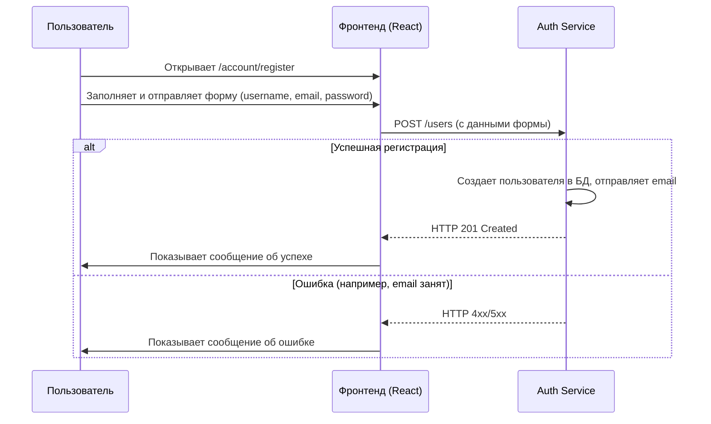

# Сценарии использования (Детальный обзор)

Этот документ описывает ключевые сценарии взаимодействия пользователя с системой, иллюстрируя их с помощью подробных диаграмм последовательности.

## 1. Аутентификация

### UC-1: Регистрация нового пользователя

*   **Описание:** Новый пользователь создает учетную запись.

### UC-2: Вход в систему

*   **Описание:** Зарегистрированный пользователь входит в свою учетную запись.

## 2. Управление игрой

### UC-3: Создание и запуск игры

*   **Описание:** Игрок создает игру, присоединяется к ней и запускает ее.

### UC-4: Присоединение к игре из списка

*   **Описание:** Игрок видит список игр и присоединяется к одной из них.

### UC-5: Игрок покидает игру

*   **Описание:** Игрок, находясь в лобби, решает покинуть игру.

## 3. Игровой процесс

### UC-6: Установка бомбы

*   **Описание:** Игрок нажимает пробел, чтобы установить бомбу.

### UC-7: Автоматическое обновление токена в игре

*   **Описание:** У игрока во время игры истекает `accessToken`. Клиент должен незаметно его обновить, не прерывая игровой процесс.

## 4. Редактор карт

### UC-8: Создание и сохранение шаблона карты

*   **Описание:** Пользователь создает новый шаблон карты с помощью интерактивного редактора.

