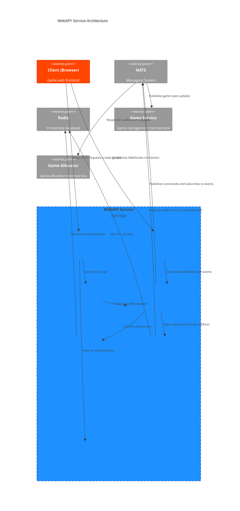

# Architecture

The `WebAPI Service` is built on the principles of modularity and clear separation of responsibilities. At its core is the **FastAPI** web framework, which provides high performance, and **Socket.IO** for real-time communication. The architecture is designed to be scalable and easily maintainable.

## Component Diagram

The diagram below illustrates the key components of the service and their relationships.

## Component Descriptions

### 1. **FastAPI App (`main.py`)**
*   **Purpose**: The entry point of the application. It initializes FastAPI, configures CORS, logging, Prometheus metrics, and mounts the Socket.IO handler.
*   **Key Operations**: Defines global `startup` and `shutdown` event handlers to manage the lifecycle of connections to external services (Redis, NATS).

### 2. **Socket.IO Server (`socketio_service.py`, `metrics_socket_server.py`)**
*   **Purpose**: Manages WebSocket connections with clients. It is wrapped in a custom `MetricsSocketServer` class to collect Prometheus metrics for events and connections.
*   **Key Operations**: Handles events from clients (`join_game`, `input`, etc.), passing them to the `GameService` for further processing. Sends game state updates (`game.update`) to clients.

### 3. **Routes (`routes/`)**
*   **Purpose**: This module is responsible for routing HTTP requests.
*   **Structure**:
    *   `root.py`: The root endpoint `/`.
    *   `api.py`: An aggregator for all v1 routes (`/api/v1`).
    *   `game_routes.py`: The endpoint for creating games (`POST /games`).
    *   `proxy_routes.py`: A universal proxy for redirecting requests to the appropriate `Game Service` instances.

### 4. **Business Logic Services (`services/`)**
*   **Purpose**: Contains the main business logic and coordinates interactions between different parts of the system.
*   **Key Services**:
    *   `game_service.py`: **The central orchestrator**. It is not the game service itself but serves to process commands from clients (via HTTP and WebSocket) and send them to NATS. It manages the player's lifecycle within the WebAPI context (binding `sid` to `game_id` and `player_id`).
    *   `nats_service.py`: A wrapper for working with NATS. It encapsulates the logic for publishing commands and subscribing to events (`game.update.*`, `game.over.*`).
    *   `game_cache.py`: Implements a two-level cache (local memory + Redis) for `Game Service` addresses to minimize latency when proxying requests.

### 5. **Data Repositories (`repositories/`)**
*   **Purpose**: An abstract layer for accessing data sources. It allows isolating business logic from the implementation details of storage.
*   **Implementations**:
    *   `redis_repository.py`: Provides asynchronous methods for working with Redis (`get`, `set`, `delete`).

### 6. **Configuration (`config.py`)**
*   **Purpose**: Manages the application's configuration. It uses `Pydantic` to read settings from environment variables and `.env` files, ensuring type validation.

### 7. **Authentication (`auth.py`)**
*   **Purpose**: Contains the authentication logic. The service trusts an upstream API Gateway (e.g., Traefik), which validates the JWT and passes user information in HTTP headers (`X-User-ID`, `X-User-Role`). Middleware in `main.py` extracts this data and places it in `request.state`.

### 8. **Models and Entities (`models/`, `entities/`)**
*   **Purpose**: Define the data structures used in the application.
    *   `models/`: Contains Pydantic models for validating data in API requests and responses.
    *   `entities/`: Contains core business entities, such as enumerations (`Enum`), like `GameModeType`.
