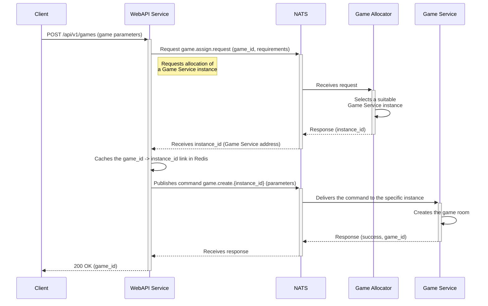
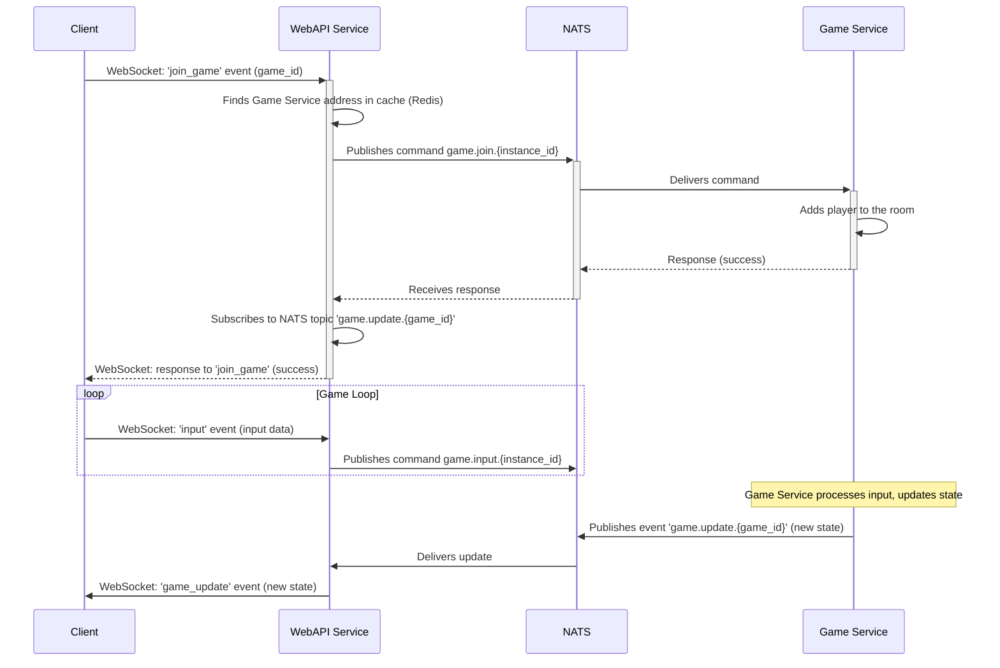
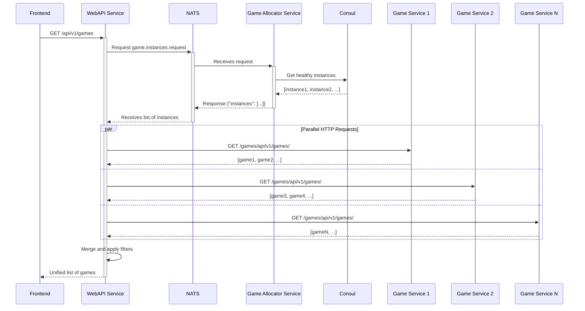

# Interaction with Other Services
[](../ru/interactions.md)

The `WebAPI Service` is a central hub that coordinates data flows between clients and backend services. The interaction is built on a combination of synchronous (HTTP) and asynchronous (NATS) protocols.

## Sequence Diagram: Creating a Game

This scenario shows how a new game session is created. The process is initiated by the client and requires the participation of the `Game Allocator Service` to allocate resources.



**Process Description:**
1.  The **Client** sends an HTTP POST request to `/api/v1/games`, passing the settings for the future game.
2.  The **WebAPI Service** receives the request and generates a unique `game_id`.
3.  The WebAPI sends a `game.assign.request` to NATS to find a suitable `Game Service` for the new game.
4.  The **Game Allocator Service**, subscribed to this topic, receives the request, selects the least loaded `Game Service` instance, and returns its address (`instance_id`).
5.  The WebAPI caches the received address in **Redis**, linking it to the `game_id`.
6.  The WebAPI publishes a `game.create` command to NATS, directing it to the specific `Game Service` instance (using the `instance_id` in the message topic).
7.  The **Game Service** receives the command, creates the game, and returns a confirmation.
8.  The WebAPI sends a successful response to the client.

## Sequence Diagram: Gameplay (WebSocket)

This scenario describes the main gameplay loop: joining a game, exchanging data in real-time, and receiving updates.



**Process Description:**
1.  After the game is created, the **Client** sends a `join_game` WebSocket event.
2.  The **WebAPI Service** finds the `Game Service` address associated with the `game_id` in the Redis cache.
3.  The WebAPI sends a `game.join` command to NATS for the corresponding `Game Service`.
4.  The **Game Service** adds the player and confirms the join.
5.  Upon receiving confirmation, the WebAPI subscribes to the `game.update.{game_id}` topic in NATS to receive all updates for this game.
6.  The client sends action data (e.g., movement) via an `input` WebSocket event.
7.  The WebAPI broadcasts this event to NATS as a `game.input` command for the `Game Service`.
8.  The **Game Service** processes the player's actions, updates the game state, and publishes it to the `game.update.{game_id}` topic.
9.  The WebAPI, being subscribed to this topic, receives the update and immediately forwards it to all clients in the corresponding game room via WebSocket.

## Sequence Diagram: Getting List of Games

This scenario shows how the WebAPI aggregates games from all `Game Service` instances to provide a unified list.



**Process Description:**
1.  The **Frontend** sends an HTTP GET request to `/api/v1/games` with optional filter parameters.
2.  The **WebAPI Service** requests a list of all healthy `Game Service` instances from `Game Allocator Service` via NATS using the `game.instances.request` event.
3.  The **Game Allocator Service** queries **Consul** to get the list of healthy `game-service` instances.
4.  The Allocator returns the list of instances (addresses and ports) to WebAPI via NATS.
5.  The WebAPI makes parallel HTTP requests to each `Game Service` instance, requesting their list of games with the same filter parameters.
6.  Each **Game Service** instance returns its own list of games.
7.  The WebAPI merges all results, applies pagination (limit/offset), and returns the unified list to the client.

## Sequence Diagram: HTTP Request Proxying

This scenario shows how the WebAPI forwards standard HTTP requests (e.g., to get detailed game statistics) directly to the `Game Service`.

```mermaid
sequenceDiagram
    participant C as Client
    participant W as WebAPI Service
    participant Cache as Redis Cache
    participant GS as Game Service

    C->>+W: GET /api/v1/game-service/{game_id}/stats
    W->>+Cache: Request: get(games:{game_id})
    Cache-->>-W: Response: instance_id (Game Service address)
    alt Address found
        W->>+GS: HTTP GET /stats (proxies request)
        GS-->>-W: HTTP 200 OK (statistics data)
        W-->>-C: HTTP 200 OK (proxies response)
    else Address not found
        W-->>-C: HTTP 404 Not Found
    end
```

**Process Description:**
1.  The **Client** sends an HTTP request to an endpoint intended for proxying, e.g., `.../game-service/{game_id}/stats`.
2.  The **WebAPI Service** extracts the `game_id` from the URL.
3.  It queries its **cache (Redis)** to find the `instance_id` (address) of the `Game Service` that is handling this game.
4.  If the address is found, the WebAPI, using an HTTP client (`httpx`), creates an identical request and sends it to `http://{instance_id}/stats`.
5.  The **Game Service** processes the request and returns a response.
6.  The WebAPI fully proxies the response (body, headers, status code) back to the client.
7.  If the address is not found in the cache, the WebAPI returns a `404 Not Found` error.
