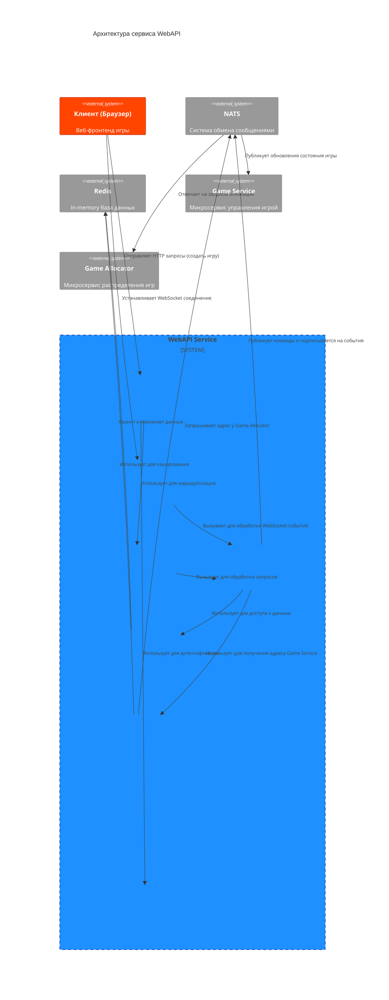

# Архитектура

`WebAPI Service` построен на принципах модульности и четкого разделения ответственности. В основе лежит веб-фреймворк **FastAPI**, обеспечивающий высокую производительность, и **Socket.IO** для коммуникации в реальном времени. Архитектура спроектирована так, чтобы быть масштабируемой и легко поддерживаемой.

## Диаграмма компонентов

Диаграмма ниже иллюстрирует ключевые компоненты сервиса и их взаимосвязи.

## Описание компонентов

### 1. **FastAPI App (`main.py`)**
*   **Назначение**: Точка входа в приложение. Инициализирует FastAPI, настраивает CORS, логирование, метрики Prometheus и монтирует обработчик Socket.IO.
*   **Ключевые операции**: Определяет глобальные обработчики событий `startup` и `shutdown` для управления жизненным циклом соединений с внешними сервисами (Redis, NATS).

### 2. **Socket.IO Server (`socketio_service.py`, `metrics_socket_server.py`)**
*   **Назначение**: Управляет WebSocket-соединениями с клиентами. Обернут в кастомный класс `MetricsSocketServer` для сбора метрик Prometheus по событиям и соединениям.
*   **Ключевые операции**: Обрабатывает события от клиентов (`join_game`, `input` и др.), передавая их в `GameService` для дальнейшей обработки. Отправляет обновления состояния игры (`game.update`) клиентам.

### 3. **Routes (`routes/`)**
*   **Назначение**: Модуль отвечает за маршрутизацию HTTP-запросов.
*   **Структура**:
    *   `root.py`: Корневой эндпоинт `/`.
    *   `api.py`: Агрегатор всех маршрутов версии v1 (`/api/v1`).
    *   `game_routes.py`: Эндпоинт для создания игр (`POST /games`).
    *   `proxy_routes.py`: Универсальный прокси для перенаправления запросов на соответствующие экземпляры `Game Service`.

### 4. **Business Logic Services (`services/`)**
*   **Назначение**: Содержит основную бизнес-логику и координирует взаимодействие между различными частями системы.
*   **Ключевые сервисы**:
    *   `game_service.py`: **Центральный оркестратор**. Не является самим игровым сервисом, а служит для обработки команд от клиентов (через HTTP и WebSocket) и их отправки в NATS. Управляет жизненным циклом игрока в контексте WebAPI (привязка `sid` к `game_id` и `player_id`).
    *   `nats_service.py`: Обертка для работы с NATS. Инкапсулирует логику публикации команд и подписки на события (`game.update.*`, `game.over.*`).
    *   `game_cache.py`: Реализует двухуровневое кэширование (локальная память + Redis) для адресов `Game Service`, чтобы минимизировать задержки при проксировании запросов.

### 5. **Data Repositories (`repositories/`)**
*   **Назначение**: Абстрактный слой для доступа к источникам данных. Позволяет изолировать бизнес-логику от деталей реализации хранилищ.
*   **Реализации**:
    *   `redis_repository.py`: Предоставляет асинхронные методы для работы с Redis (`get`, `set`, `delete`).

### 6. **Configuration (`config.py`)**
*   **Назначение**: Управляет конфигурацией приложения. Использует `Pydantic` для чтения настроек из переменных окружения и `.env` файла, обеспечивая валидацию типов.

### 7. **Authentication (`auth.py`)**
*   **Назначение**: Содержит логику проверки аутентификации. Сервис доверяет вышестоящему API Gateway (например, Traefik), который валидирует JWT и передает информацию о пользователе в HTTP-заголовках (`X-User-ID`, `X-User-Role`). Middleware в `main.py` извлекает эти данные и помещает в `request.state`.

### 8. **Models и Entities (`models/`, `entities/`)**
*   **Назначение**: Определяют структуры данных, используемые в приложении.
    *   `models/`: Содержит Pydantic-модели для валидации данных в API-запросах и ответах.
    *   `entities/`: Содержит основные бизнес-сущности, например, перечисления (`Enum`), такие как `GameModeType`.
