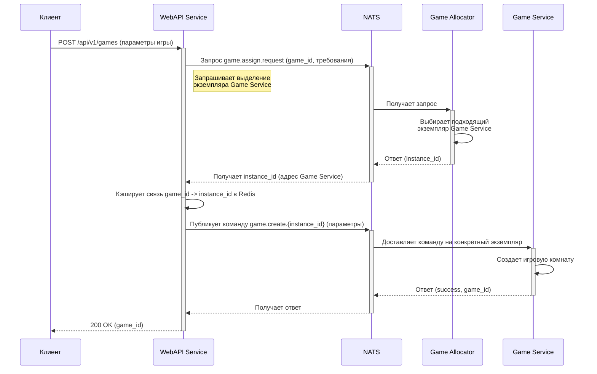
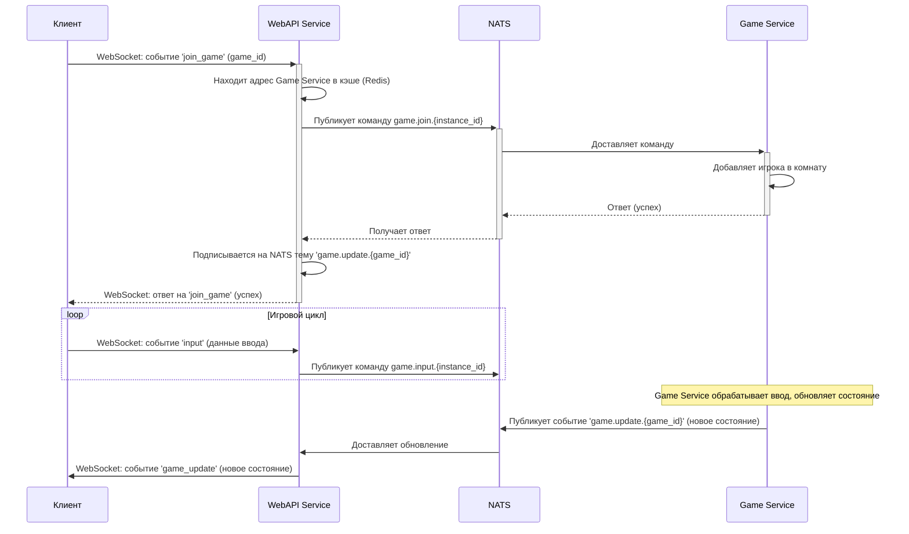

# Взаимодействие с другими сервисами
[](../en/interactions.md)

`WebAPI Service` является центральным узлом, который координирует потоки данных между клиентами и бэкенд-сервисами. Взаимодействие построено на комбинации синхронных (HTTP) и асинхронных (NATS) протоколов.

## Диаграмма последовательности: Создание игры

Этот сценарий показывает, как создается новая игровая сессия. Процесс инициируется клиентом и требует участия `Game Allocator Service` для выделения ресурсов.



**Описание процесса:**
1.  **Клиент** отправляет HTTP POST запрос на `/api/v1/games`, передавая настройки будущей игры.
2.  **WebAPI Service** получает запрос, генерирует уникальный `game_id`.
3.  WebAPI отправляет запрос `game.assign.request` в NATS, чтобы найти подходящий `Game Service` для новой игры.
4.  **Game Allocator Service**, подписанный на эту тему, получает запрос, выбирает наименее нагруженный экземпляр `Game Service` и возвращает его адрес (`instance_id`).
5.  WebAPI кэширует полученный адрес в **Redis**, связывая его с `game_id`.
6.  WebAPI публикует команду `game.create` в NATS, направляя ее на конкретный экземпляр `Game Service` (используя `instance_id` в теме сообщения).
7.  **Game Service** получает команду, создает игру и возвращает подтверждение.
8.  WebAPI передает успешный ответ клиенту.

## Диаграмма последовательности: Игровой процесс (WebSocket)

Этот сценарий описывает основной игровой цикл: присоединение к игре, обмен данными в реальном времени и получение обновлений.



**Описание процесса:**
1.  **Клиент** после создания игры отправляет WebSocket-событие `join_game`.
2.  **WebAPI Service** находит в кэше Redis адрес `Game Service`, связанный с `game_id`.
3.  WebAPI отправляет команду `game.join` в NATS для соответствующего `Game Service`.
4.  **Game Service** добавляет игрока и подтверждает присоединение.
5.  Получив подтверждение, WebAPI подписывается на тему `game.update.{game_id}` в NATS, чтобы получать все обновления по этой игре.
6.  Клиент отправляет данные о действиях (например, движение) через WebSocket-событие `input`.
7.  WebAPI транслирует это событие в NATS как команду `game.input` для `Game Service`.
8.  **Game Service** обрабатывает действия игрока, обновляет игровое состояние и публикует его в тему `game.update.{game_id}`.
9.  WebAPI, будучи подписанным на эту тему, получает обновление и немедленно пересылает его всем клиентам в соответствующей игровой комнате через WebSocket.

## Диаграмма последовательности: Проксирование HTTP-запросов

Этот сценарий показывает, как WebAPI перенаправляет стандартные HTTP-запросы (например, для получения детальной статистики по игре) напрямую в `Game Service`.

```mermaid
sequenceDiagram
    participant C as Клиент
    participant W as WebAPI Service
    participant Cache as Redis Cache
    participant GS as Game Service

    C->>+W: GET /api/v1/game-service/{game_id}/stats
    W->>+Cache: Запрос: get(games:{game_id})
    Cache-->>-W: Ответ: instance_id (адрес Game Service)
    alt Адрес найден
        W->>+GS: HTTP GET /stats (проксирует запрос)
        GS-->>-W: HTTP 200 OK (данные статистики)
        W-->>-C: HTTP 200 OK (проксирует ответ)
    else Адрес не найден
        W-->>-C: HTTP 404 Not Found
    end
```

**Описание процесса:**
1.  **Клиент** отправляет HTTP-запрос на эндпоинт, предназначенный для проксирования, например, `.../game-service/{game_id}/stats`.
2.  **WebAPI Service** извлекает `game_id` из URL.
3.  Он обращается к своему **кэшу (Redis)**, чтобы найти `instance_id` (адрес) `Game Service`, который обслуживает эту игру.
4.  Если адрес найден, WebAPI, используя HTTP-клиент (`httpx`), создает идентичный запрос и отправляет его на `http://{instance_id}/stats`.
5.  **Game Service** обрабатывает запрос и возвращает ответ.
6.  WebAPI полностью проксирует ответ (тело, заголовки, статус-код) обратно клиенту.
7.  Если адрес в кэше не найден, WebAPI возвращает ошибку `404 Not Found`.
